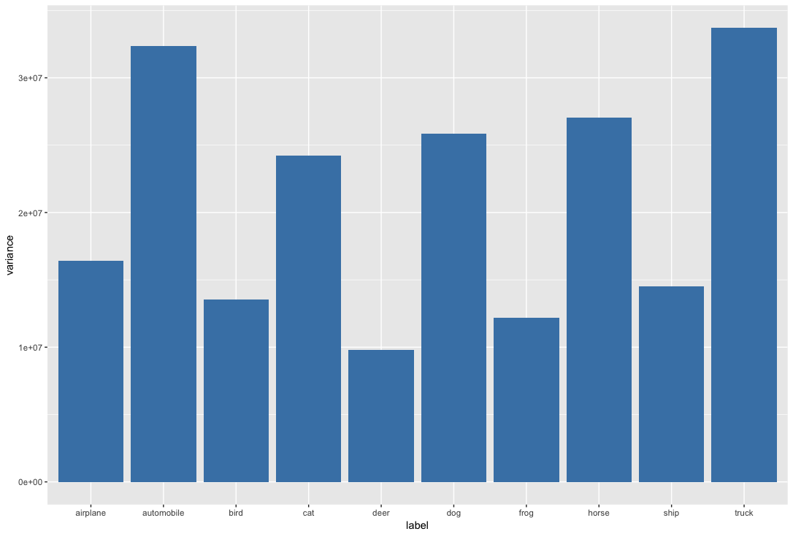
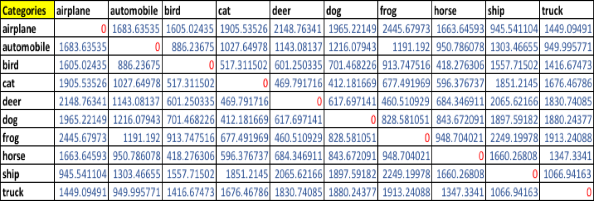
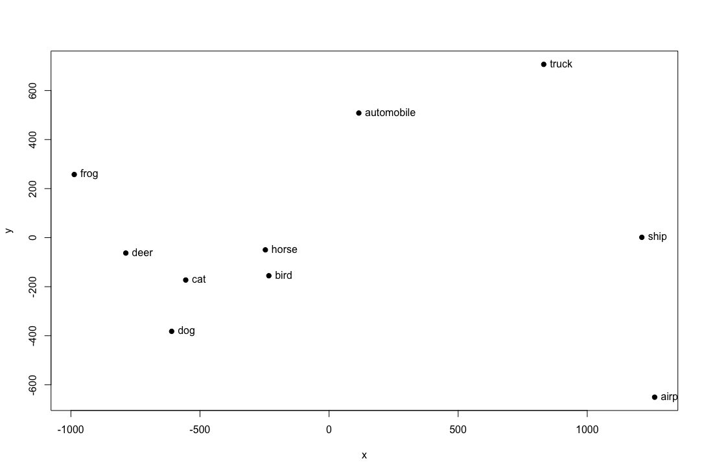
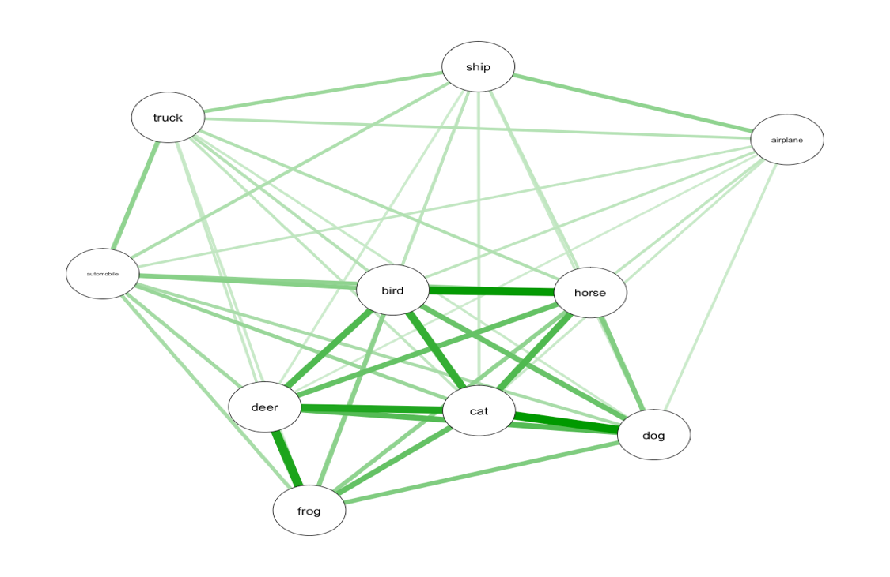
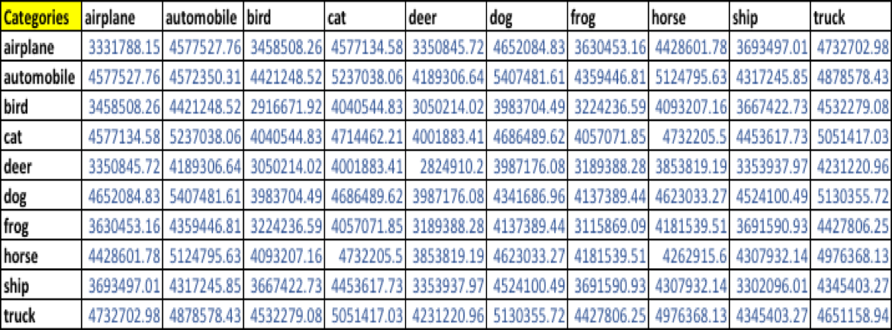
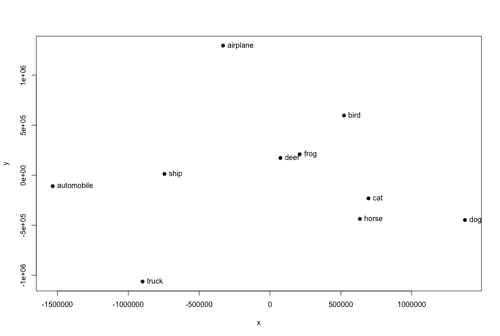
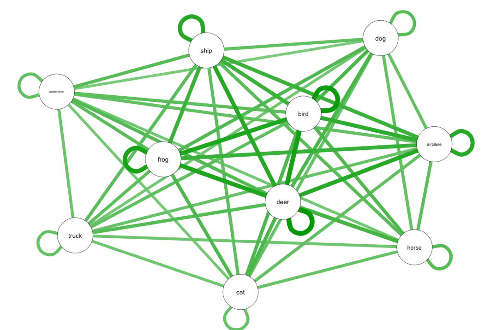

**Dataset**

CIFAR-10 is a dataset of 32x32 images in 10 categories, collected by Alex Krizhevsky, Vinod Nair, and Geoffrey Hinton. It is often used to evaluate machine learning algorithms. It can be downloaded from https:// www.cs.toronto.edu/~kriz/cifar.html.

The dataset consists of 60000 32x32 colour images in 10 classes, with 6000 images per class. There are 50000 training images and 10000 test images. The dataset is divided into five training batches and one test batch, each with 10000 images. The test batch contains exactly 1000 randomly-selected images from each class. The training batches contain the remaining images in random order, but some training batches may contain more images from one class than another. Between them, the training batches contain exactly 5000 images from each class.

The label classes in the dataset are:

+ airplane 
+ automobile 
+ bird 
+ cat 
+ deer 
+ dog 
+ frog 
+ horse 
+ ship 
+ truck

The classes are completely mutually exclusive. There is no overlap between automobiles and trucks. "Automobile" includes sedans, SUVs, things of that sort. "Truck" includes only big trucks. Neither includes pickup trucks.

**Image Similarity and Principal Coordinate Analysis**

I cycled through the binary image files and imported the dataset into R dataframe using the readBin function. The dataset contained three columns corresponding to the r,g and b values of the individual images. I used the grid.raster function in R to reconstruct a few sample images just to confirm that the import was successful.

For each category, computed the mean image and the first 20 principal components. Plotted the error resulting from representing the images of each category using the first 20 principal components against the category. Below is the plot -

Then I computed the distances between mean images for each pair of classes using a well known distance measure - Euclidean distance measure. I computed istances by thinking of the images as vectors and used principal coordinate analysis to make a 2D map of the means of each categories. Below is the 2D plot and computed distance matrix.

**Euclidean Distance Matrix**

**2D Plot using PCA - Euclidean distance measure**

**Network Graph**

Then I tried another measure of the similarity of two image classes. For image class A and image class B, I computed E(A | B) to be the average error obtained by representing all the images of class A using the mean of class A and the first 20 principal components of class B. I then computed the similarity between classes to be (1/2)(E(A | B) + E(B | A)). If A and B were very similar, then this error would be small, because A's principal components should be good at representing B. But if they were very different, then A's principal components should represent B poorly. In turn, the similarity measure would be big. Using principal coordinate analysis I made a 2D map of the classes as seen below.

The plot generated using Euclidean distance measure and the special similarity measure look very similar in terms of how the categories are clustered for most of the images categories and the similarity between them. The low dimensional image reconstruction using the 20 PCs from the same category and the reconstruction using the 20 PCs of other categories in the special similarity measure approach had a small difference in variance (per pixel difference averaged over all image categories) and that is an interesting fact probably because the first 20 PCs contributed significantly to variance in all image categories & their cumulative variances were similar. The first 20 PCs had drastic impact on change in quality but as more PCs were added there was a sequential improvement in quality. 

**Special Similarity Distance Matrix**

**2D Plot using PCA - Special similarity measure**

**Network Graph**

