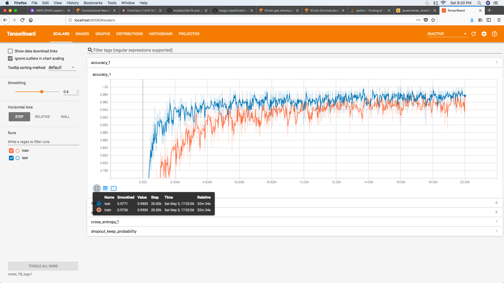
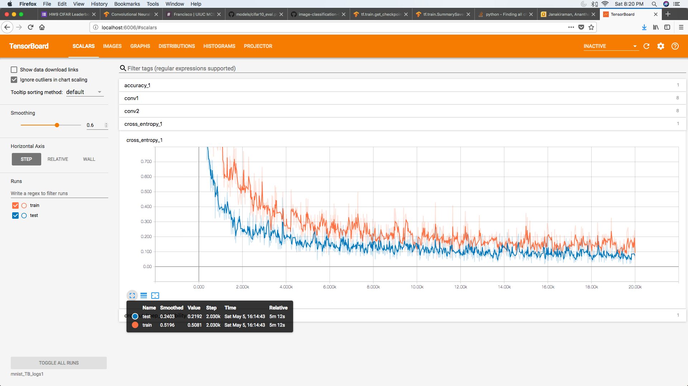
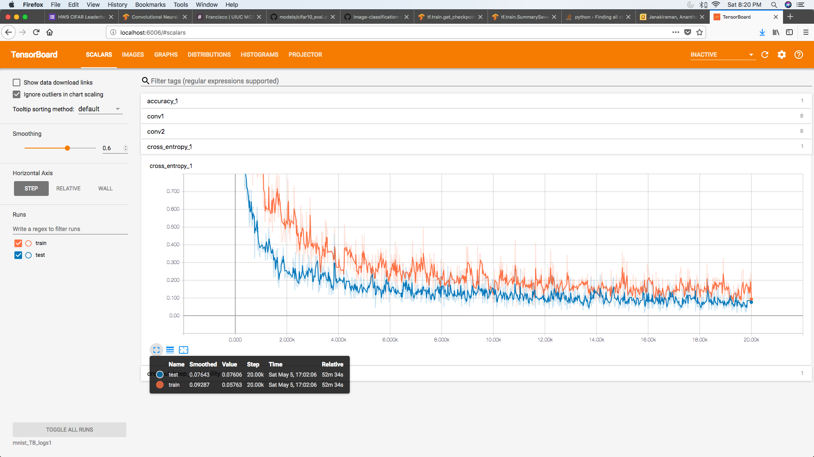
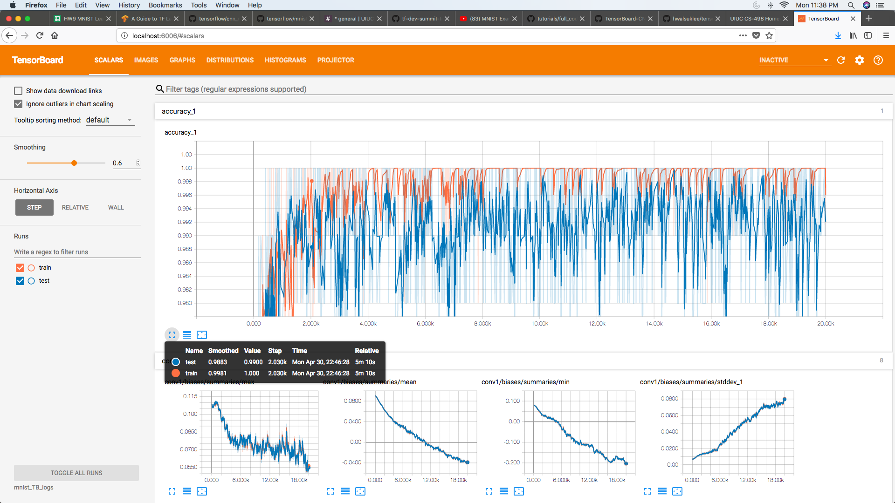
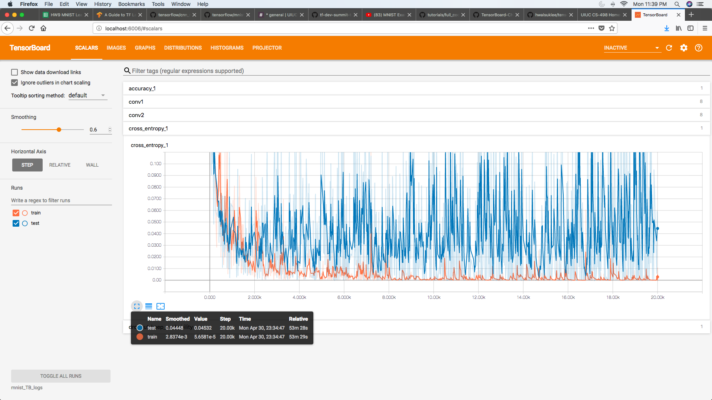
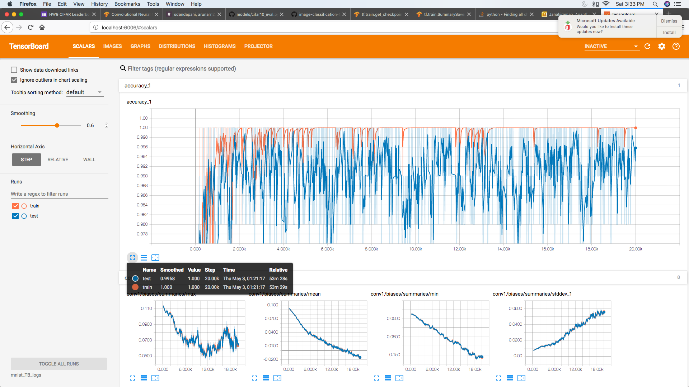
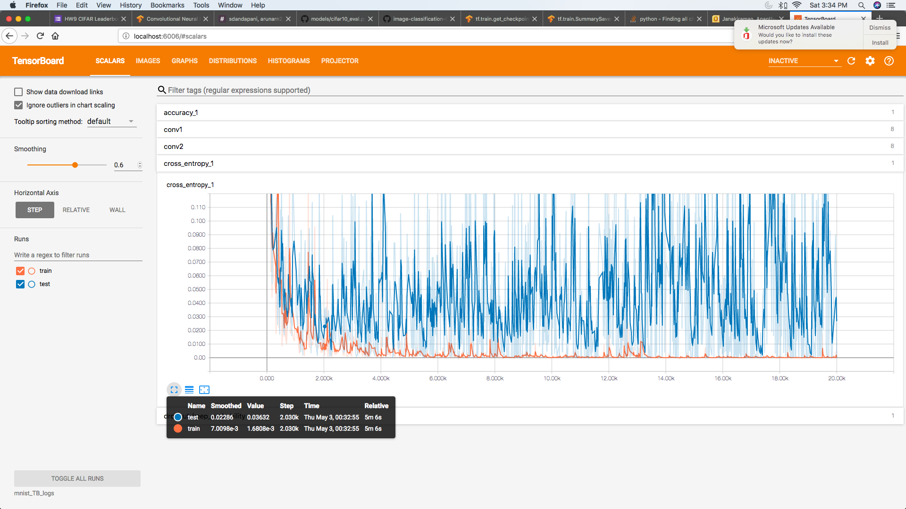
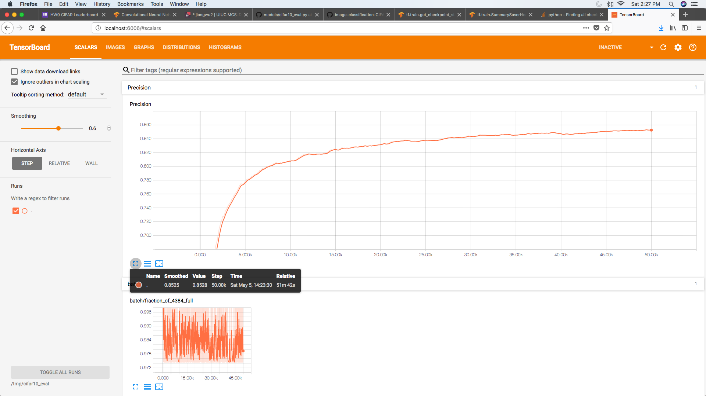
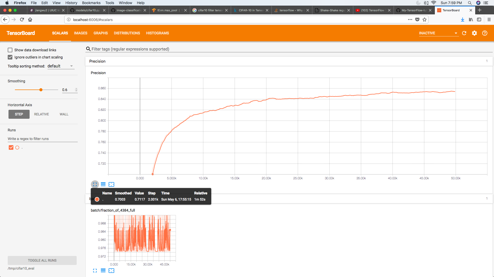
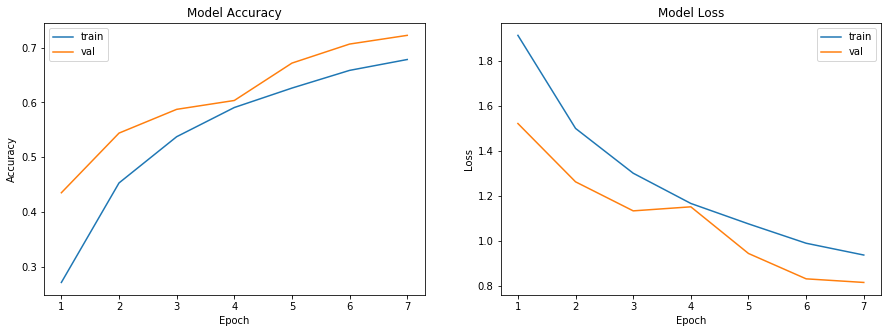

**Datasets**

**MNIST**

The MNIST dataset is a dataset of 60,000 training and 10,000 test examples of handwritten digits, originally constructed by Yann Lecun, Corinna Cortes, and Christopher J.C. Burges. It is very widely used to check several methods. There are 10 classes in total ("0" to "9"). This dataset has been extensively studied, and there is a history of methods and feature constructions at https://en.wikipedia.org/wiki/MNIST_database and at the original site, http://yann.lecun.com/exdb/mnist/. Please note that the best methods perform extremely well.

There is also a version of the data that was used for a Kaggle competition. This can be used as well for convenience so there would not be a need decompress Lecun's original format. It can be found at http://www.kaggle.com/c/digit-recognizer .

I used the original MNIST data files from http://yann.lecun.com/exdb/mnist/ , the dataset is stored in an unusual format, described in detail on the page. Regardless of the format of the dataset, it consists of 28 x 28 images. These were originally binary images, but appear to be grey level images as a result of some anti-aliasing. 

**CIFAR-10**

CIFAR-10 is a dataset of 32x32 images in 10 categories, collected by Alex Krizhevsky, Vinod Nair, and Geoffrey Hinton. It is often used to evaluate machine learning algorithms. It can be downloaded from https:// www.cs.toronto.edu/~kriz/cifar.html.

The dataset consists of 60000 32x32 colour images in 10 classes, with 6000 images per class. There are 50000 training images and 10000 test images. The dataset is divided into five training batches and one test batch, each with 10000 images. The test batch contains exactly 1000 randomly-selected images from each class. The training batches contain the remaining images in random order, but some training batches may contain more images from one class than another. Between them, the training batches contain exactly 5000 images from each class.

The label classes in the dataset are:

+ airplane
+ automobile
+ bird
+ cat
+ deer
+ dog
+ frog
+ horse
+ ship
+ truck

The classes are completely mutually exclusive. There is no overlap between automobiles and trucks. "Automobile" includes sedans, SUVs, things of that sort. "Truck" includes only big trucks. Neither includes pickup trucks.

**TensorFlow**

The TensorFlow layers module provides a high-level API that makes it easy to construct a neural network. It provides methods that facilitate the creation of dense (fully connected) layers and convolutional layers, adding activation functions, and applying dropout regularization. In this project, we'll learn how to use layers to build a basic convolutional neural network model and later improve the model accuracy to recognize the handwritten digits in the MNIST data set.

**Convolutional Neural Networks**

Convolutional neural networks (CNNs) are the current state-of-the-art model architecture for image classification tasks. CNNs apply a series of filters to the raw pixel data of an image to extract and learn higher-level features, which the model can then use for classification. CNNs contains three components:

Convolutional layers, which apply a specified number of convolution filters to the image. For each subregion, the layer performs a set of mathematical operations to produce a single value in the output feature map. Convolutional layers then typically apply a ReLU activation function to the output to introduce nonlinearities into the model.

Pooling layers, which downsample the image data extracted by the convolutional layers to reduce the dimensionality of the feature map in order to decrease processing time. A commonly used pooling algorithm is max pooling, which extracts subregions of the feature map (e.g., 2x2-pixel tiles), keeps their maximum value, and discards all other values.

Dense (fully connected) layers, which perform classification on the features extracted by the convolutional layers and downsampled by the pooling layers. In a dense layer, every node in the layer is connected to every node in the preceding layer.

Typically, a CNN is composed of a stack of convolutional modules that perform feature extraction. Each module consists of a convolutional layer followed by a pooling layer. The last convolutional module is followed by one or more dense layers that perform classification. The final dense layer in a CNN contains a single node for each target class in the model (all the possible classes the model may predict), with a softmax activation function to generate a value between 0–1 for each node (the sum of all these softmax values is equal to 1). We can interpret the softmax values for a given image as relative measurements of how likely it is that the image falls into each target class.

**Building the CNN MNIST Classifier Model**

I built a model to classify the images in the MNIST dataset using the following CNN architecture:

1. Convolutional Layer #1: Applies 32 5x5 filters (extracting 5x5-pixel subregions), with ReLU activation function
2. Pooling Layer #1: Performs max pooling with a 2x2 filter and stride of 2 (which specifies that pooled regions do not overlap)
3. Convolutional Layer #2: Applies 64 5x5 filters, with ReLU activation function
4. Pooling Layer #2: Again, performs max pooling with a 2x2 filter and stride of 2
5. Dense Layer #1: 1,024 neurons, with dropout regularization rate of 0.4 (probability of 0.4 that any given element will be dropped during training)
6. Dense Layer #2 (Logits Layer): 10 neurons, one for each digit target class (0–9).

The create each of the three layer types described above I used the following functions in tensorflow.

+ conv2d(). Constructs a two-dimensional convolutional layer. Takes number of filters, filter kernel size, padding, and activation function as arguments.
+ max_pooling2d(). Constructs a two-dimensional pooling layer using the max-pooling algorithm. Takes pooling filter size and stride as arguments.
+ dense(). Constructs a dense layer. Takes number of neurons and activation function as arguments.
Each of these methods accepts a tensor as input and returns a transformed tensor as output. This makes it easy to connect one layer to another: just take the output from one layer-creation method and supply it as input to another.

**Training and Evaluating the CNN MNIST Classifier**

**Load Training and Test Data**

I stored the training feature data (the raw pixel values for 55,000 images of hand-drawn digits) and training labels (the corresponding value from 0–9 for each image) as numpy arrays in train_data and train_labels, respectively. Similarly, I stored the evaluation feature data (10,000 images) and evaluation labels in eval_data and eval_labels, respectively.

**Create the Estimator**

Next, I created an Estimator (a TensorFlow class for performing high-level model training, evaluation, and inference) for the model. The model_fn argument specifies the model function to use for training, evaluation, and prediction; I passed it the cnn_model_fn that was created in "Building the CNN MNIST Classifier." The model_dir argument specifies the directory where model data (checkpoints) will be saved.

**Set Up a Logging Hook**

Since CNNs can take a while to train, I set up some logging so we can track progress during training. I used tf.Session() and Saver.save() function to save the checkpoint file every 100 epochs for a total of 20000 steps.

**Train the Model**

Next I trained the model, which I did by creating train_input_fn and calling train() on mnist_classifier. In the numpy_input_fn call, we pass the training feature data and labels to x (as a dict) and y, respectively. We set a batch_size of 100 (which means that the model will train on minibatches of 100 examples at each step). num_epochs=None means that the model will train until the specified number of steps is reached. In the train call, we set steps=20000 (which means the model will train for 20,000 steps total). We save the checkpoint every 100 steps during training.

**Evaluate the Model and Run the model**

Once training is complete, I wanted to evaluate the model to determine its accuracy on the MNIST test set. The basic model came up with a test accuracy of 0.9442 after 2k steps and 0.9771 after 20k steps.

**MNIST Baseline Accuracy at 2K steps**

**MNIST Baseline Accuracy at 20K steps**

**MNIST Baseline Cross Entropy at 2K steps**

**MNIST Baseline Cross Entropy at 20K steps**

**MNIST Improved Model (Type 1)**

I made the following improvements to the baseline model discussed in the previous section.

1.	Changed the optimizer to AdamOptimizer from GradientDescentOptimizer
2.	Retained the keep_prob as 0.6 for the training set.
3.	I used the same convolution and pooling layers, kernel size and strides from the baseline model.
4.	Used the same batch size of 100 and displayed train and test accuracy values every 10 steps.

Test Accuracy after 2K Steps	- 0.9883
Test Accuracy after 20K Steps -	0.9920

**MNIST Improved Accuracy at 2K steps**

**MNIST Improved Accuracy at 20K steps**

**MNIST Improved Cross Entropy at 2K steps**

**MNIST Improved Cross Entropy at 20K steps**

**MNIST Improved Model (Type 2)**

I made the following improvements to the baseline model discussed in the previous section.

1.	Changed the optimizer to AdamOptimizer from GradientDescentOptimizer
2.	Changed the keep_prob from 0.6 to 0.9.
3.	I used the same convolution and pooling layers, kernel size and strides from the baseline model.
4.	Used the same batch size of 100 and displayed train and test accuracy values every 10 steps.

Test Accuracy after 2K Steps	- 0.9931
Test Accuracy after 20K Steps -	0.9958

**MNIST Improved Accuracy at 2K steps**

**MNIST Improved Accuracy at 20K steps**

**MNIST Improved Cross Entropy at 2K steps**

**MNIST Improved Cross Entropy at 20K steps**

**CIFAR-10 Model**

I built a model to classify the images in the CIFAR-10 dataset using the following CNN architecture:

|Layer Name	   |  Description                                              |
|------------: | :------------------------------------------------------:  |
|conv1	        |  convolution and rectified linear activation.             |
|pool1	        |  max pooling.                                             |
|norm1	        |  local response normalization.                            |
|conv2	        |  convolution and rectified linear activation.             |
|norm2	        |  local response normalization.                            |
|pool2	        |  max pooling.                                             |
|local3	       |  fully connected layer with rectified linear activation.  |
|local4	       |  fully connected layer with rectified linear activation.  |
|softmax_linear|	 linear transformation to produce logits.                 |

**Checkpoint for Evaluation**

1.	I introduced a CheckPointSaver hook in cifar10_train.py that saves checkpoint files every 100 steps with max_to_keep parameter of the Saver object set to 500 because I wanted to save checkpoint files every 100 steps for a total of 50K steps (500 * 100 = 50K).
2.	In cifar10_eval.py, I retrieved all of the checkpoint paths using all_model_checkpoint_paths (500 checkpoint paths) and loop through them. I evaluated test accuracy during each loop instance which represents a checkpoint path for every 100 steps.
3. I updated the max number of steps to 50K and used a batch size of 128. 

**Model Training**

The usual method for training a network to perform N-way classification is multinomial logistic regression, aka. softmax regression. Softmax regression applies a softmax nonlinearity to the output of the network and calculates the cross-entropy between the normalized predictions and the label index. For regularization, we also apply the usual weight decay losses to all learned variables. The objective function for the model is the sum of the cross entropy loss and all these weight decay terms, as returned by the loss() function. I visualized it in TensorBoard with a tf.summary.scalar.

I trained the model using standard gradient descent algorithm with a learning rate that exponentially decays over time. The train() function adds the operations needed to minimize the objective by calculating the gradient and updating the learned variables. It returns an operation that executes all the calculations needed to train and update the model for one batch of images.

I ran python cifar10_train.py to train the model.

**Evaluating the Model**

I then evaluate how well the trained model performed on a hold-out data set. The model is evaluated by the script cifar10_eval.py. It constructs the model with the inference() function and uses all 10,000 images in the evaluation set of CIFAR-10. It calculates the precision at 1: how often the top prediction matches the true label of the image.

To monitor how the model improves during training, the evaluation script runs periodically on the latest checkpoint files created by the cifar10_train.py.

To run evaluation: python cifar10_eval.py

**Baseline CIFAR-10 Performance**

Test Accuaracy after 2K steps using the baseline model   - 0.6902

Test Accuaracy after 50K steps using the baseline model  - 0.8525

**CIFAR-10 Baseline Accuracy at 50K steps**

**CIFAR-10 Baseline Accuracy at 2K steps**

**CIFAR-10 Improved (Type-1) Model**

I made the following changes to the network in the baseline model to improve the accuracy.

1.	On the first convolution layer, changed the kernel size to (3,3) from (5,5).
2.	Changed the output filters on the first convolution layer from 64 to 96 and the corresponding biases.
3.	On the second convolution layer, changed the kernel size to (3,3) from (5,5).
4.	The number of output filters in the second convolution layer is 64 and the input filters is 96.
5.	Did not make any changes to the local response normalization parameters for any of the convolution layers.
6.	The strides for max pooling layer-2 was updated from [1,2,2,1] to [1,1,1,1].
7.	No changes were made to the fully connected layers, first max pooling layer and strides.
8.	The changes made to cifar10_train.py and cifar10_eval.py were retained.

**Improved(Type-1) CIFAR-10 Performance**

Test Accuaracy after 2K steps using the baseline model   - 0.7003

**CIFAR-10 Improved (Type-1) Accuracy at 2K steps**

**CIFAR-10 Improved (Type-2) Model**

I tried another model that uses Keras python library to train and test the CNN model. It also uses matplotlib to plot the accuracy graph (as seen below), batch normalization and uses a tensorflow backend. The model also employs data augmentation for improved accuracy.

The model architecture is described below and network follows the same sequence as detailed below,
1.	A convolution layer with 48 filters and kernel size (3, 3) that accepts an input with shape (3,32,32) and “same” border_mode so that the output image is of the same dimension as the input image.
2.	A second convolution layer with 48 filters and kernel size (3, 3)
3.	A max pooling layer with pool_size – (2,2)
4.	Specified dropout rate of 0.25 from the prior layer to the next convolution layer.
5.	A third convolution layer with 96 filters and kernel size (3, 3) with “same” border_mode.
6.	A fourth convolution layer with 96 filters and kernel size (3, 3)
7.	A second max pooling layer with pool_size – (2,2)
8.	Specified dropout rate of 0.25 from the prior layer to the next convolution layer.
9.	A fifth convolution layer with 192 filters and kernel size (3, 3) with “same” border_mode.
10.	A sixth convolution layer with 192 filters and kernel size (3, 3)
11.	A third max pooling layer with pool_size – (2,2)
12.	Specified dropout rate of 0.25 from the prior layer to the next convolution layer.
13.	Reshape and flatten the output from the prior layer.
14.	The output is fed to a Densely connected layer with 512 units.
15.	Specified dropout rate of 0.5 from the prior dense layer to the next densely connected layer
16.	The output is fed to a Densely connected layer with 256 units.
17.	Specified dropout rate of 0.5 from the prior dense layer to the next densely connected layer
18.	The final densely connected layer is the output layer that uses softmax activation and 10 units one of each image class.
19.	The model is compiled with categorical cross entropy as the loss function and optimized using Adam Optimizer.
20. Training is performed for 7 epochs where each epoch consists of 390 steps and batch size of 128. The accuracy is captured at every 100 steps of each epoch. Below is the accuracy plot of Epoch vs Model Test Accuracy.

**Improved(Type-2) CIFAR-10 Performance**

Test Accuaracy after 2K steps using the baseline model   - 0.7225

**CIFAR10 Improved-2 Accuracy after 2K steps (using Matplotlib)**

**Examples CIFAR-10 models referred to and executed for improving accuracy**

1.	https://github.com/shiba24/cifar-10/blob/master/train_cnn_crop.py
2.	https://github.com/chainer/chainer/tree/master/examples/cifar
3.	https://github.com/wolfib/image-classification-CIFAR10-tf
4.	https://github.com/bestkao/cifar-10
5.	https://gist.github.com/kukuruza/6714b632c92d8967fd3c
6.	https://github.com/Gurupradeep/CIFAR-10-Object-Recognition-in-Images
7.	https://github.com/ashleyjsands/cifar-10-tensorflow
8.	https://github.com/parneetk/Neural-Networks-in-Keras
9.	https://github.com/eltonlaw/vgg-cifar10

