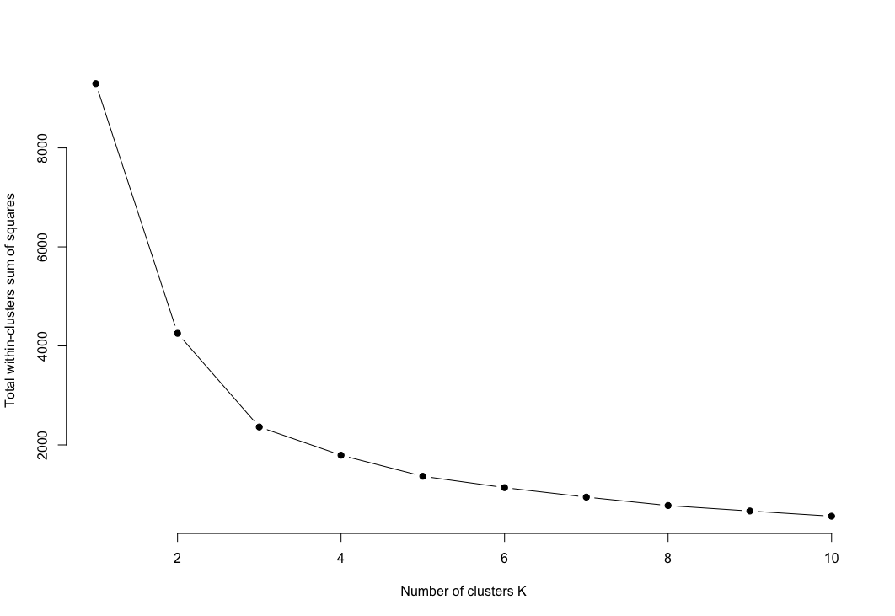
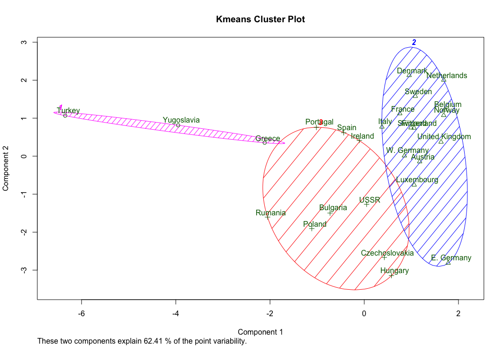
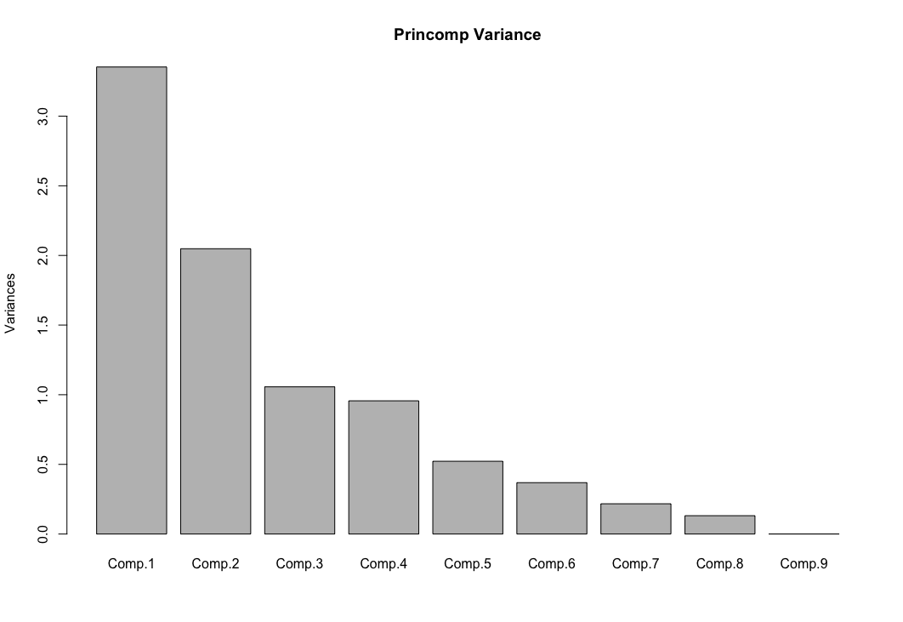
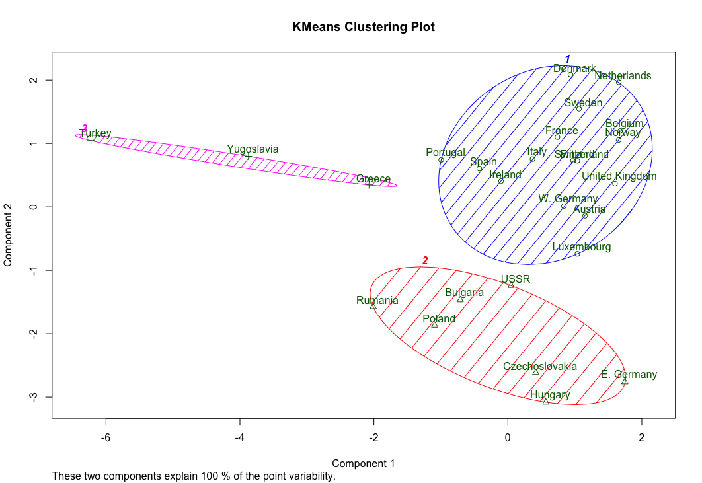

**Dataset**

We can find a dataset dealing with European employment in 1979 at http://lib.stat.cmu.edu/DASL/Stories/EuropeanJobs.html. This dataset gives the percentage of people employed in each of a set of areas in 1979 for each of a set of European countries. This is a good dataset that works well for visualization of clustering.

**Hierarchical Clustering**

This method builds the hierarchy from the individual elements by progressively merging clusters. he first step is to determine which elements to merge in a cluster. Usually, we want to take the two closest elements, according to the chosen distance. one can also construct a distance matrix at this stage, where the number in the i-th row j-th column is the distance between the i-th and j-th elements. Then, as clustering progresses, rows and columns are merged as the clusters are merged and the distances updated. This is a common way to implement this type of clustering, and has the benefit of caching distances between clusters. Usually the distance between two clusters is one of the following:

+ The maximum distance between elements of each cluster (also called complete-linkage clustering)
+ The minimum distance between elements of each cluster (also called single-linkage clustering)
+ The mean distance between elements of each cluster (also called average linkage clustering)
+ The sum of all intra-cluster variance.
+ The increase in variance for the cluster being merged (Ward's method)
+ The probability that candidate clusters spawn from the same distribution function (V-linkage)

In case of tied minimum distances, a pair is randomly chosen, thus being able to generate several structurally different dendrograms. Alternatively, all tied pairs may be joined at the same time, generating a unique dendrogram.

One can always decide to stop clustering when there is a sufficiently small number of clusters (number criterion). Some linkages may also guarantee that agglomeration occurs at a greater distance between clusters than the previous agglomeration, and then one can stop clustering when the clusters are too far apart to be merged (distance criterion). However, this is not the case of, e.g., the centroid linkage where the so-called reversals (inversions, departures from ultrametricity) may occur.

I used an agglomerative clusterer to cluster the data. I produced a dendrogram of this data for each of single link, complete link, and group average clustering. I labelled the countries on the axis. I made plots using R's hclust clustering function, and then turning the result into a phylogenetic tree and using a fan plot. I was able to see dendrograms that made sense and have interesting differences.

**Average Link**

**Complete Link**

**Single Link**

**K-Means Clustering**

K-means is a simple unsupervised machine learning algorithm that groups a dataset into a user-specified number (k) of clusters. The algorithm is somewhat naive--it clusters the data into k clusters, even if k is not the right number of clusters to use. Therefore, when using k-means clustering, users need some way to determine whether they are using the right number of clusters.

**Elbow curve method**

One method to validate the number of clusters is the elbow method. The idea of the elbow method is to run k-means clustering on the dataset for a range of values of k (say, k from 1 to 10 in the examples above), and for each value of k calculate the sum of squared errors (SSE). Then, plot a line chart of the SSE for each value of k. If the line chart looks like an arm, then the "elbow" on the arm is the value of k that is the best. The idea is that we want a small SSE, but that the SSE tends to decrease toward 0 as we increase k (the SSE is 0 when k is equal to the number of data points in the dataset, because then each data point is its own cluster, and there is no error between it and the center of its cluster). So our goal is to choose a small value of k that still has a low SSE, and the elbow usually represents where we start to have diminishing returns by increasing k. Based on this method the ideal number of clusters for our dataset seemed to be 3.

**KMeans using Data - 3 Clusters (based on the elbow curve above)**
*(4 clusters is optimal too but plotted with 3 clusters)*

**Principal Component Analysis**

PCA serves as a dimensionality reduction method on the features of our original dataset by projecting these features onto a lower dimension. I tried to reduce the number of columns (i.e features) in the original dataset down to 3 columns. I also used the measure of Explained Variance to motivate and inform our search on getting the right number of PCA projections. Below is the variance plot explaining the percentage variance on each of the principal component. The plot shows that the first 3 principal components explain more than 85% of variance on the data.
**Variance Plot**

**KMeans using PCA**

