**Dataset**

We can find a dataset dealing with European employment in 1979 at http://lib.stat.cmu.edu/DASL/Stories/EuropeanJobs.html. This dataset gives the percentage of people employed in each of a set of areas in 1979 for each of a set of European countries. This is a good dataset that works well for visualization of clustering.

For Vector Quantization I used daily life dataset from the UC Irvine machine learning website (https://archive.ics.uci.edu/ml/datasets/Dataset+for+ADL+Recognition+with+Wrist-worn+Accelerometer data provided by Barbara Bruno, Fulvio Mastrogiovanni and Antonio Sgorbissa). This dataset consists of examples of the signal from a wrist mounted accelerometer, produced as different subjects engaged in different activities of daily life. Activities include: brushing teeth, climbing stairs, combing hair, descending stairs, and so on. Each is performed by sixteen volunteers. The accelerometer samples the data at 32Hz (i.e. this data samples and reports the acceleration 32 times per second). The
accelerations are in the x, y and z-directions. 

**Hierarchical Clustering**

This method builds the hierarchy from the individual elements by progressively merging clusters. he first step is to determine which elements to merge in a cluster. Usually, we want to take the two closest elements, according to the chosen distance. one can also construct a distance matrix at this stage, where the number in the i-th row j-th column is the distance between the i-th and j-th elements. Then, as clustering progresses, rows and columns are merged as the clusters are merged and the distances updated. This is a common way to implement this type of clustering, and has the benefit of caching distances between clusters. Usually the distance between two clusters is one of the following:

+ The maximum distance between elements of each cluster (also called complete-linkage clustering)
+ The minimum distance between elements of each cluster (also called single-linkage clustering)
+ The mean distance between elements of each cluster (also called average linkage clustering)
+ The sum of all intra-cluster variance.
+ The increase in variance for the cluster being merged (Ward's method)
+ The probability that candidate clusters spawn from the same distribution function (V-linkage)

In case of tied minimum distances, a pair is randomly chosen, thus being able to generate several structurally different dendrograms. Alternatively, all tied pairs may be joined at the same time, generating a unique dendrogram.

One can always decide to stop clustering when there is a sufficiently small number of clusters (number criterion). Some linkages may also guarantee that agglomeration occurs at a greater distance between clusters than the previous agglomeration, and then one can stop clustering when the clusters are too far apart to be merged (distance criterion). However, this is not the case of, e.g., the centroid linkage where the so-called reversals (inversions, departures from ultrametricity) may occur.

I used an agglomerative clusterer to cluster the data. I produced a dendrogram of this data for each of single link, complete link, and group average clustering. I labelled the countries on the axis. I made plots using R's hclust clustering function, and then turning the result into a phylogenetic tree and using a fan plot. I was able to see dendrograms that made sense and have interesting differences.

**Average Link**

**Complete Link**

**Single Link**

**K-Means Clustering**

K-means is a simple unsupervised machine learning algorithm that groups a dataset into a user-specified number (k) of clusters. The algorithm is somewhat naive--it clusters the data into k clusters, even if k is not the right number of clusters to use. Therefore, when using k-means clustering, users need some way to determine whether they are using the right number of clusters.

**Elbow curve method**

One method to validate the number of clusters is the elbow method. The idea of the elbow method is to run k-means clustering on the dataset for a range of values of k (say, k from 1 to 10 in the examples above), and for each value of k calculate the sum of squared errors (SSE). Then, plot a line chart of the SSE for each value of k. If the line chart looks like an arm, then the "elbow" on the arm is the value of k that is the best. The idea is that we want a small SSE, but that the SSE tends to decrease toward 0 as we increase k (the SSE is 0 when k is equal to the number of data points in the dataset, because then each data point is its own cluster, and there is no error between it and the center of its cluster). So our goal is to choose a small value of k that still has a low SSE, and the elbow usually represents where we start to have diminishing returns by increasing k. Based on this method the ideal number of clusters for our dataset seemed to be 3.

**KMeans using Data - 3 Clusters (based on the elbow curve above)**
*(4 clusters is optimal too but plotted with 3 clusters)*

**Principal Component Analysis**

PCA serves as a dimensionality reduction method on the features of our original dataset by projecting these features onto a lower dimension. I tried to reduce the number of columns (i.e features) in the original dataset down to 3 columns. I also used the measure of Explained Variance to motivate and inform our search on getting the right number of PCA projections. Below is the variance plot explaining the percentage variance on each of the principal component. The plot shows that the first 3 principal components explain more than 85% of variance on the data.

**Variance Plot**

**KMeans using PCA**
 

**Vector Quantization**

I built a random forest classifier that classifies sequences into one of the 14 activities provided. To make features, I vector quantized, then used a histogram of cluster centers.

There is an important problem with using the accelerometer data. Different subjects take quite different amounts of time to perform the activities. For example, some subjects might be more thorough tooth-brushers than other subjects. As another example, people with longer legs walk at somewhat different frequencies than people with shorter legs. This means that the same activity performed by different subjects will produce data vectors that are of different lengths. It’s not a good idea to deal with this by warping time and resampling the signal. For example, doing so will make a thorough toothbrusher look as though they are moving their hands very fast (or a careless toothbrusher look ludicrously slow: think speeding up or slowing down a movie). So we need a representation that can cope with signals that are a bit longer or shorter than other signals.

Another important property of these signals is that all examples of a particular activity should contain repeated patterns. For example, brushing teeth should show fast accelerations up and down; walking should show a strong signal at somewhere around 2 Hz; and so on. These two points should suggest vector quantization to you. Representing the signal in terms of stylized, repeated structures is probably a good idea because the signals probably contain these structures. And if we represent the signal in terms of the relative frequency with which these structures occur, the representation will have a fixed length, even if the signal doesn’t. To do so, we need to consider (a) over what time scale we will see these repeated structures and (b) how to ensure we segment the signal into pieces so that we see these structures.

Generally, repetition in activity signals is so obvious that we don’t need to be smart about segment boundaries. I broke these signals into 32 sample segments, one following the other. Each segment represents one second of activity. This is long enough for the body to do something interesting, but not so long that our representation will suffer if we put the segment boundaries in the wrong place. This resulted in about 20k to 40K segments. I then used k-means to cluster these segments with different cluster centers and settled with k=480. I then computed histogram representations for different signals and noticed that when the activity label is different, the histogram looked different, too.

Another useful way to check this representation is to compare the average within class chi-squared distance with the average between class chi-squared distance. I computed the histogram for each example. Then, for each pair of examples, I computed the chi-squared distance between the pair. Finally, for each pair of activity labels, I computed the average distance between pairs of examples where one example has one of the activity labels and the other example has the other activity label. In the ideal case, all the examples with the same label would be very close to one another, and all examples with different labels would be rather different. 

I obtained an accuracy of 72.02% with 32 segments and 480 clusters without any signal overlap and an accuracy of 71.428% with signal overlap. Below are the confusion matrices.

**Length-32 Segment and 480 Clusters – No Overlap : Accuracy – 72.02%**
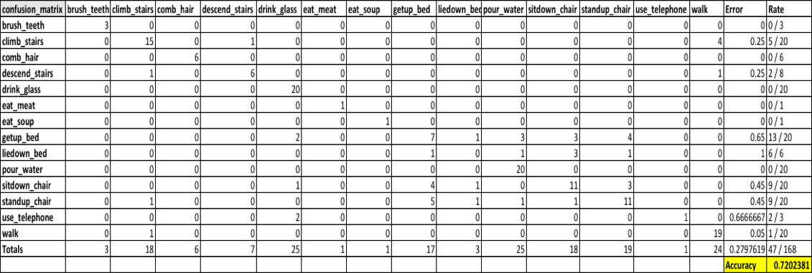

**Length-32 Segment and 480 Clusters – With Overlap : Accuracy – 71.428%**
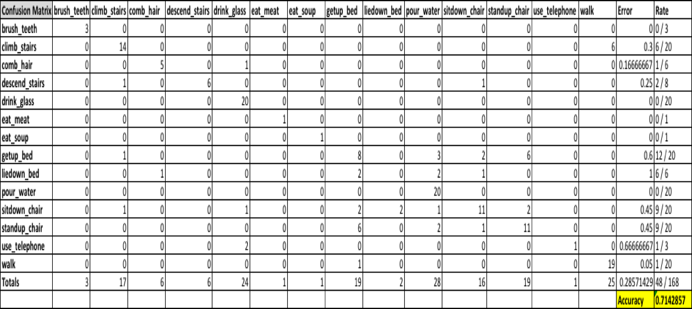

**Improvement on Vector Quantization**

**Length-16 Segment and 480 Clusters – No Overlap : Accuracy – 76.19%**

**Length-16 Segment and 480 Clusters – With Overlap : Accuracy – 77.97%**

**Histogram Plots on Training Data**

**Brush Teeth Plot**
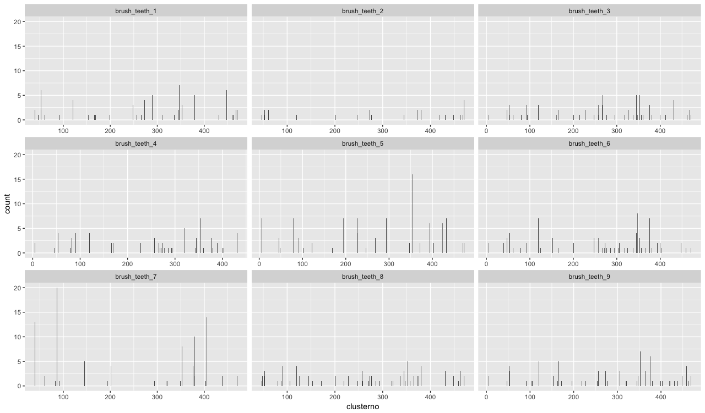

**Climb Stairs Plot**
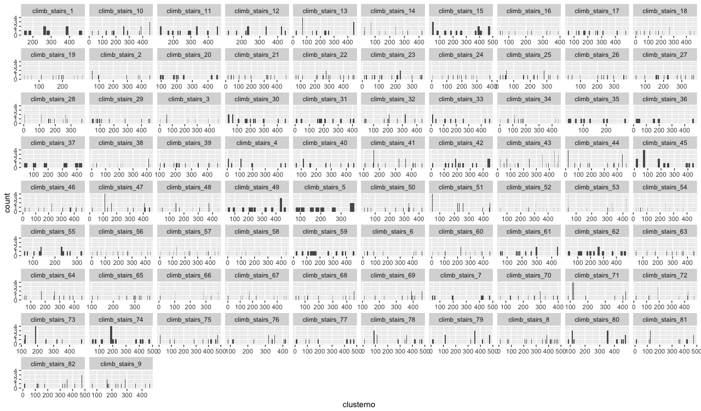

**Comb Hair Plot**
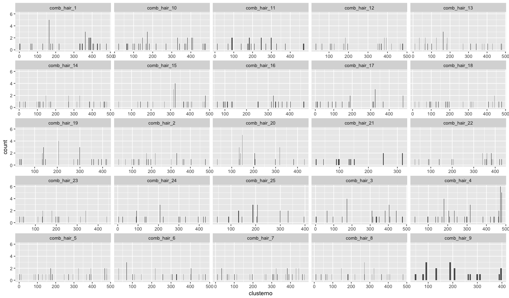

**Descend Stairs Plot**
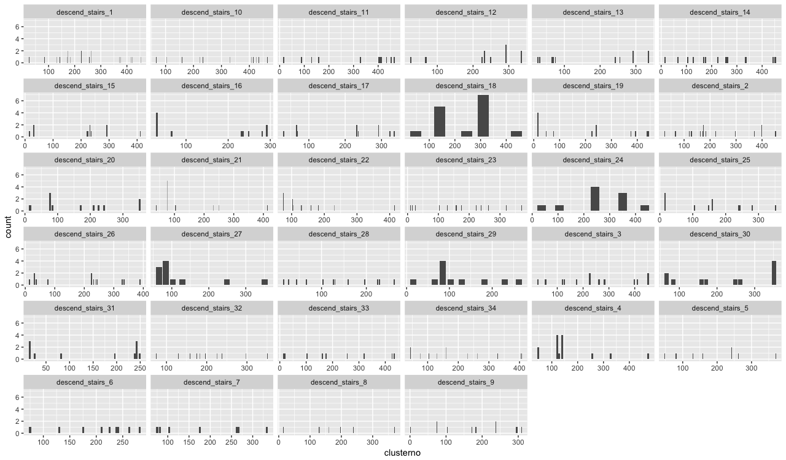

**Drink Glass Plot**
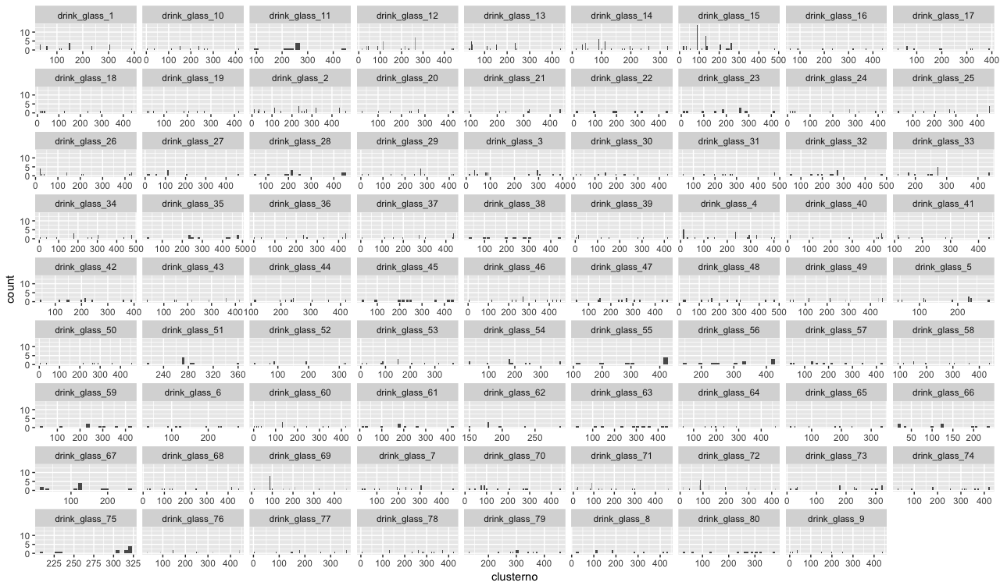

**Eat Meat Plot**
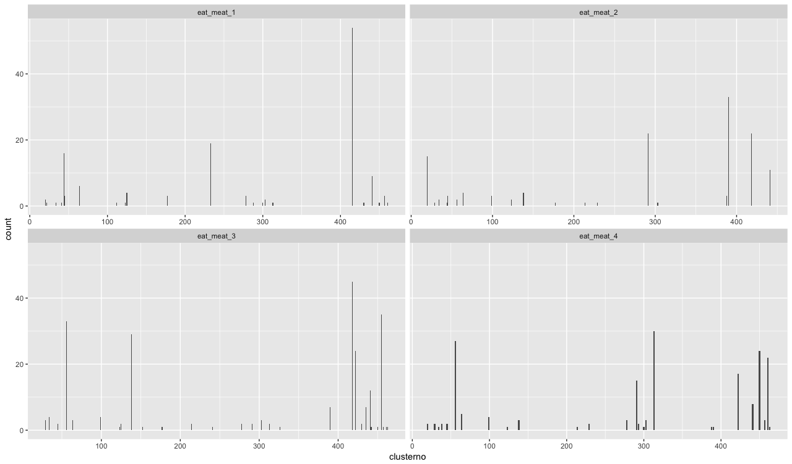

**Eat Soup Plot**
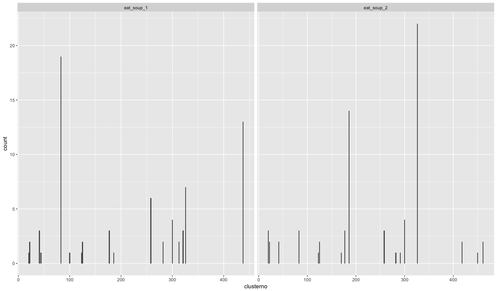

**Getup Bed Plot**
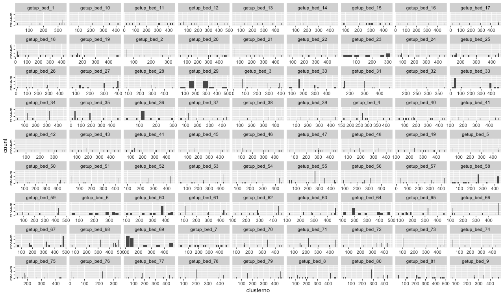

**Liedown Bed Plot**
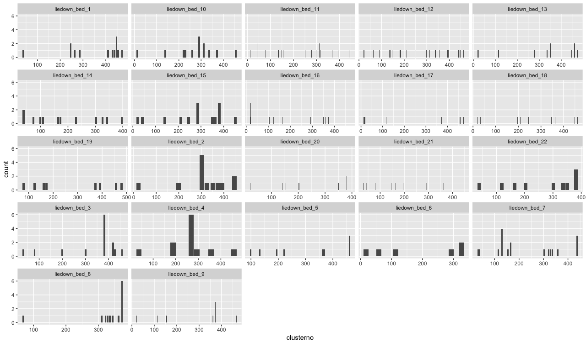

**Pour Water Plot**
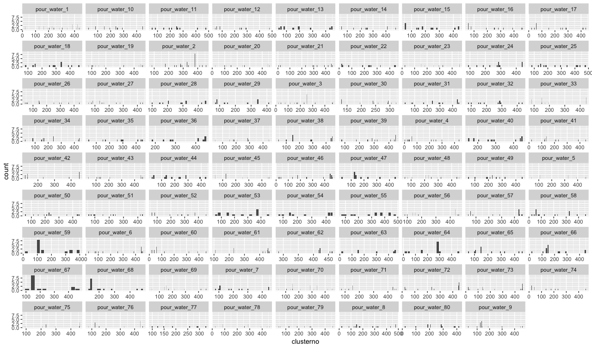

**Sitdown Chair Plot**
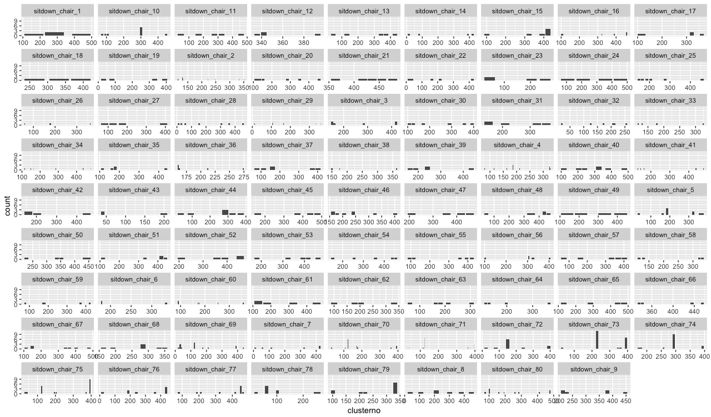

**Standup Chair Plot**
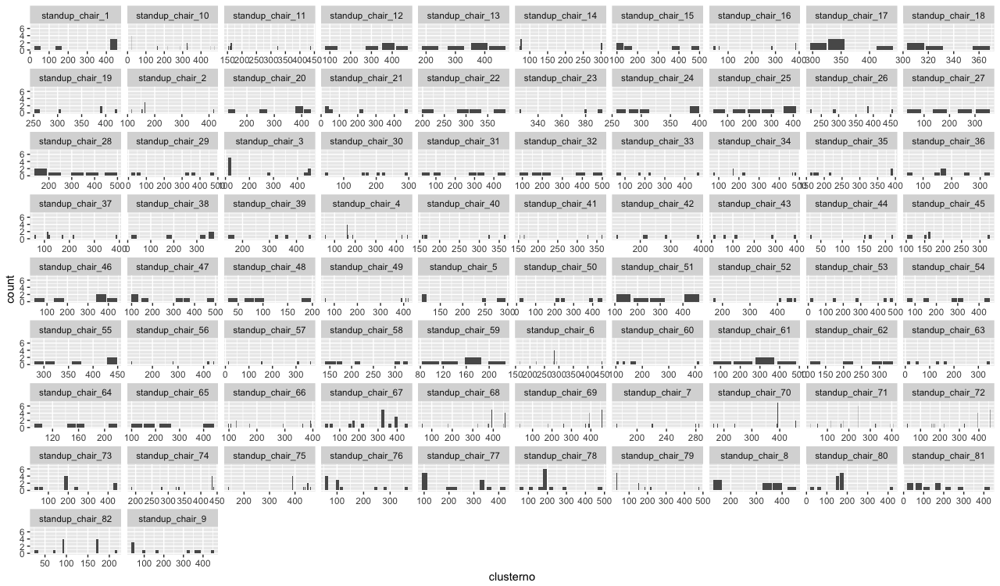

**Use telephone Plot**
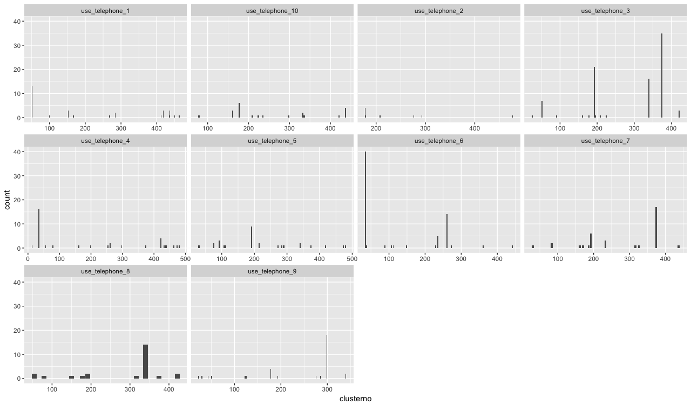

**Walk Plot**

**Walk Plot**

