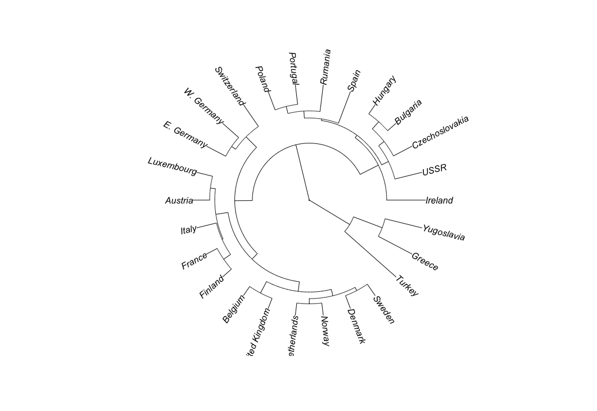
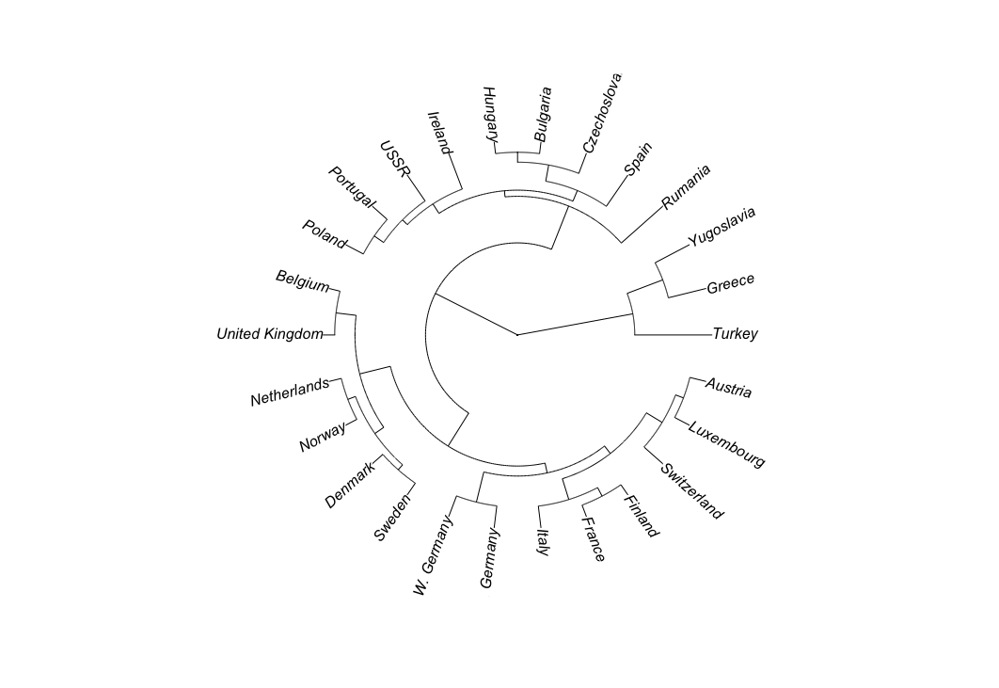
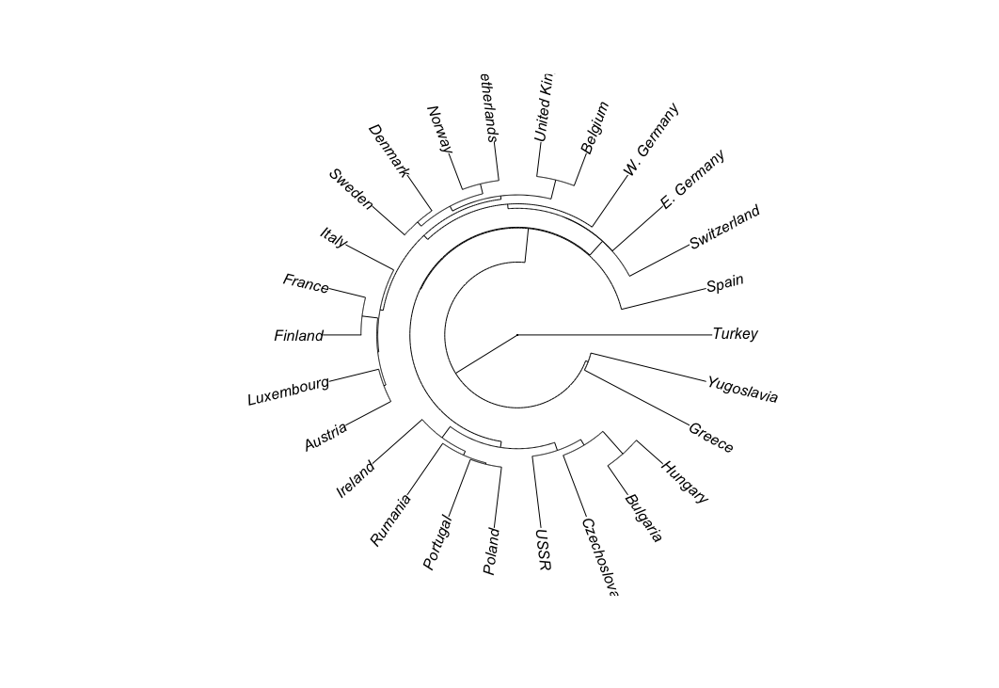

**Dataset**

We can find a dataset dealing with European employment in 1979 at http://lib.stat.cmu.edu/DASL/Stories/EuropeanJobs.html. This dataset gives the percentage of people employed in each of a set of areas in 1979 for each of a set of European countries. This is a good dataset that works well for visualization of clustering.

**Hierarchical Clustering**

This method builds the hierarchy from the individual elements by progressively merging clusters. he first step is to determine which elements to merge in a cluster. Usually, we want to take the two closest elements, according to the chosen distance. one can also construct a distance matrix at this stage, where the number in the i-th row j-th column is the distance between the i-th and j-th elements. Then, as clustering progresses, rows and columns are merged as the clusters are merged and the distances updated. This is a common way to implement this type of clustering, and has the benefit of caching distances between clusters. Usually the distance between two clusters is one of the following:

+ The maximum distance between elements of each cluster (also called complete-linkage clustering)
+ The minimum distance between elements of each cluster (also called single-linkage clustering)
+ The mean distance between elements of each cluster (also called average linkage clustering)
+ The sum of all intra-cluster variance.
+ The increase in variance for the cluster being merged (Ward's method)
+ The probability that candidate clusters spawn from the same distribution function (V-linkage)

In case of tied minimum distances, a pair is randomly chosen, thus being able to generate several structurally different dendrograms. Alternatively, all tied pairs may be joined at the same time, generating a unique dendrogram.

One can always decide to stop clustering when there is a sufficiently small number of clusters (number criterion). Some linkages may also guarantee that agglomeration occurs at a greater distance between clusters than the previous agglomeration, and then one can stop clustering when the clusters are too far apart to be merged (distance criterion). However, this is not the case of, e.g., the centroid linkage where the so-called reversals (inversions, departures from ultrametricity) may occur.

I used an agglomerative clusterer to cluster the data. I produced a dendrogram of this data for each of single link, complete link, and group average clustering. I labelled the countries on the axis. I made plots using R's hclust clustering function, and then turning the result into a phylogenetic tree and using a fan plot. I was able to see dendrograms that made sense and have interesting differences.

**Average Link**

**Complete Link**

**Single Link**

Using k-means, cluster this dataset. What is a good choice of k for this data and why?
