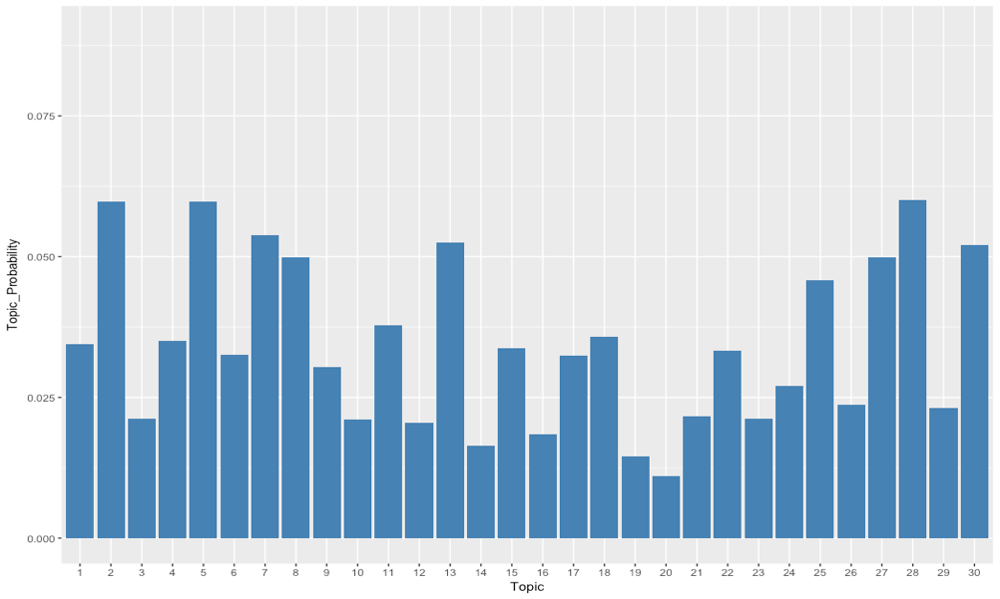
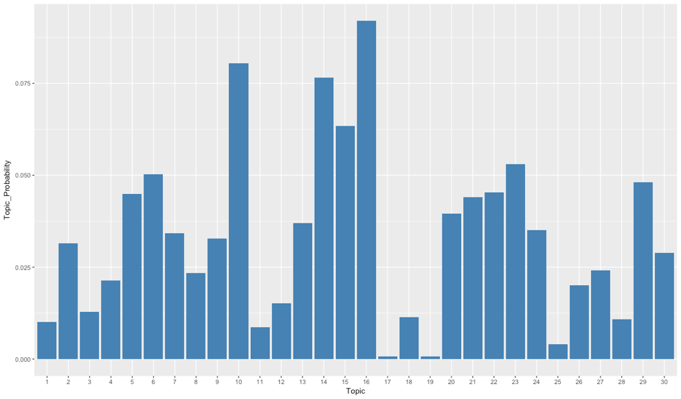
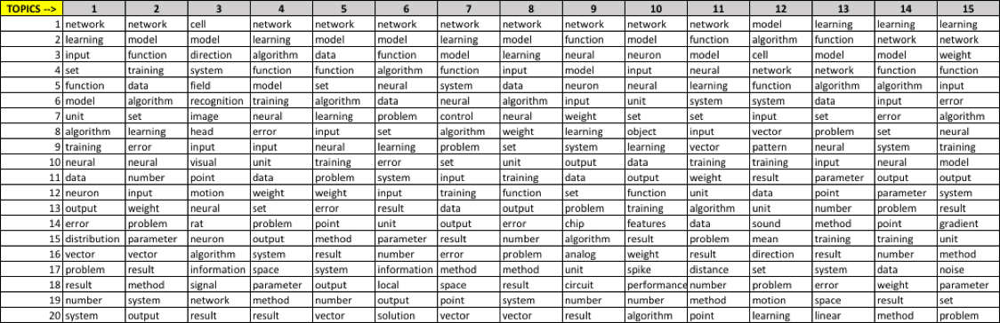
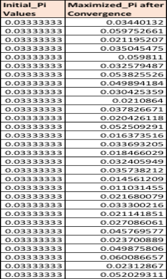
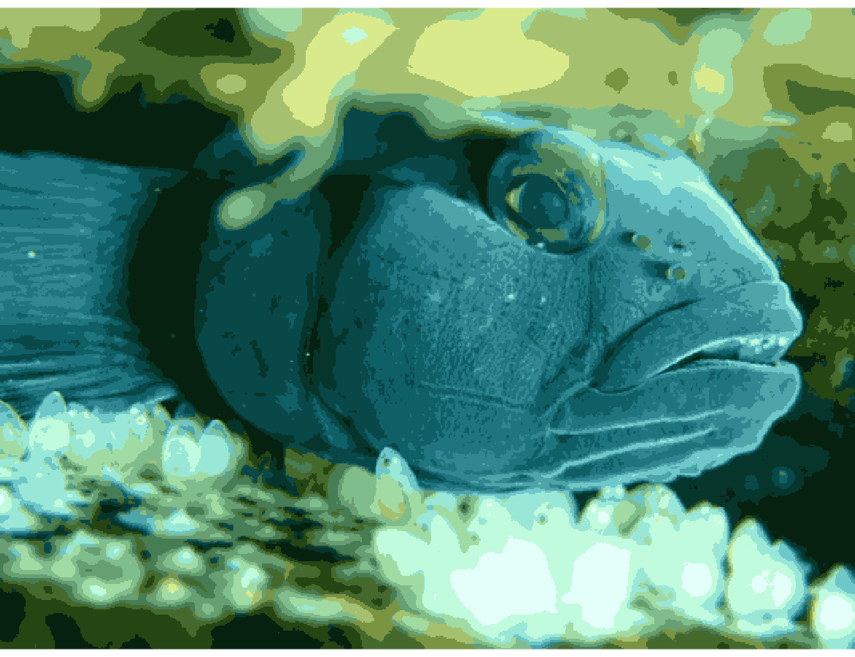
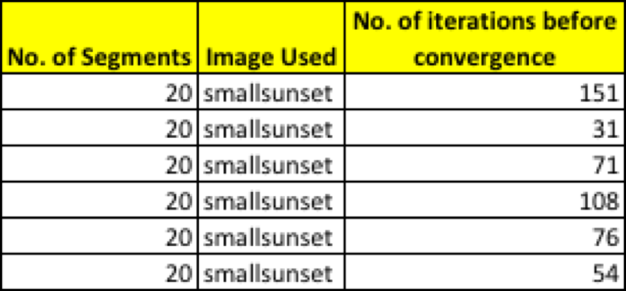

**Datasets**

The UCI Machine Learning dataset repository hosts several datasets recording word counts for documents - https://archive.ics.uci.edu/ml/datasets/Bag+of+Words. I used the NIPS dataset for my first exploration of EM using Topic Models. I found (a) a table of word counts per document and (b) a vocabulary list for this dataset at the link.

For the image segmentation exploration, I used two images that I downloaded from the internet. The images can be found in the project repository.

**THE EM ALGORITHM**

This a straightforward, natural, and very powerful algorithm. In essence, we will average out the things we don’t know. But this average will depend on our estimate of the parameters, so we will average, then re-estimate parameters, then re-average, and so on. In this analogy, the δ tell us which cluster center a data item came from. Because we don’t know the values of the δ, we assume we have a set of cluster centers; these allow us to make a soft estimate of the δ; then we use this estimate to re-estimate the centers; and so on.

This is an instance of a general recipe. In the mixture of normals case, θ contained the means and the mixing weights; in the topic model case, it contained the topic distributions and the mixing weights. Assume we have an estimate of the value of this vector, say θ(n). We could then compute p(δ θ(n), x). In the mixture of normals case, this is a guide to which example goes to which cluster. In the topic case, it is a guide to which example goes to which topic. We could use this to compute the expected value of the likelihood with respect to δ. We compute

Q(θ; θ(n)) =	Sum over δ (L(θ; x, δ)p(δ|θ(n), x))

(where the sum is over all values of δ). Notice that Q(θ; θ(n)) is a function of θ, but now does not have any unknown δ terms in it. This Q(θ; θ(n)) encodes what we know about δ.

For example, assume that p(δ θ(n), x) has a single, narrow peak in it, at (say) δ = δ0. In the mixture of normals case, this would mean that there is one allocation of points to clusters that is significantly better than all others, given θ(n). For this example, Q(θ; θ(n)) will be approximately L(θ; x, δ0).

Now assume that p(δ θ(n), x) is about uniform. In the mixture of normals case, this would mean that any particular allocation of points to  clusters is  about as good as any other.  For this example, Q(θ; θ(n)) will average over all possible δ values with about the same weight for each. We obtain the next estimate of θ by computing θ(n+1) = argmax Q(θ; θ(n)) θ
and iterate this procedure until it converges (which it does, though I shall not prove that). The algorithm I have described is extremely general and powerful, and is known as expectation maximization or (more usually) EM. The step where
we compute Q(θ; θ(n)) is called the E step; the step where we compute the new estimate of θ is known as the M step.
One trick to be aware of: it is quite usual to ignore additive constants in the log-likelihood, because they have no effect. When you do the E-step, taking the expectation of a constant gets you a constant; in the M-step, the constant can’t change the outcome.

**EM Topic Model**

Using the NIPS dataset, I implemented the multinomial mixture of topics model. For this problem, I wrote the clustering code myself (i.e. not use a package for clustering). I clustered the dataset to 30 topics, using a simple mixture of multinomial topic model.

Below is the graph I produced showing, for each topic, the probability with which the topic is selected.

**Topic Model using EM (Random initialization)**

**Topic Model using EM (KMeans initialization)**

Then, I produced a table showing, for each topic, the 10 words with the highest probability for that topic.

**Initial Pi value vs Maximized Pi value ~ 1.0**

**Image Segmentation using EM**

I segmented tbe chosen image image using the KMeans clustering method - each segment is the cluster center to which a pixel belongs. I chose a color image which has its pixels represented by r, g, and b values. I then used the EM algorithm applied to the mixture of normal distribution model to cluster image pixels, then segment the image by mapping each pixel to the cluster center with the highest value of the posterior probability for that pixel. I implemented the EM algorithm myself (rather than using a package).

I segmented each of the images to 10, 20, and 50 segments. I displayed these segmented images as images, where each pixel's color is replaced with the mean color of the closest segment. Below are the segmented images after running the EM algorithm for the different segments (10, 20, 50) respectively. 

**10 Segments (37 iterations)**

**20 Segments (132 iterations)**

**50 Segments (154 iterations)**

 

I also tried to run image segmentation (Mixture of Normals) on the smallsunset.jpg image and segmented it 20 segments using 6 or more different starting points or initializations. I can with reasonable confidence say that I observed some variations in the final image after convergence on each execution with a different starting point and also the number of iterations to converge on each starting point were different in some cases the swing was large.

Below are the results of the segmentation with different starting points. I have also included a table that shows the number iterations before convergence for each execution.

**Table**

**Execution-1**

**Execution-2**

**Execution-3**

**Execution-4**

**Execution-5**

**Execution-6**

