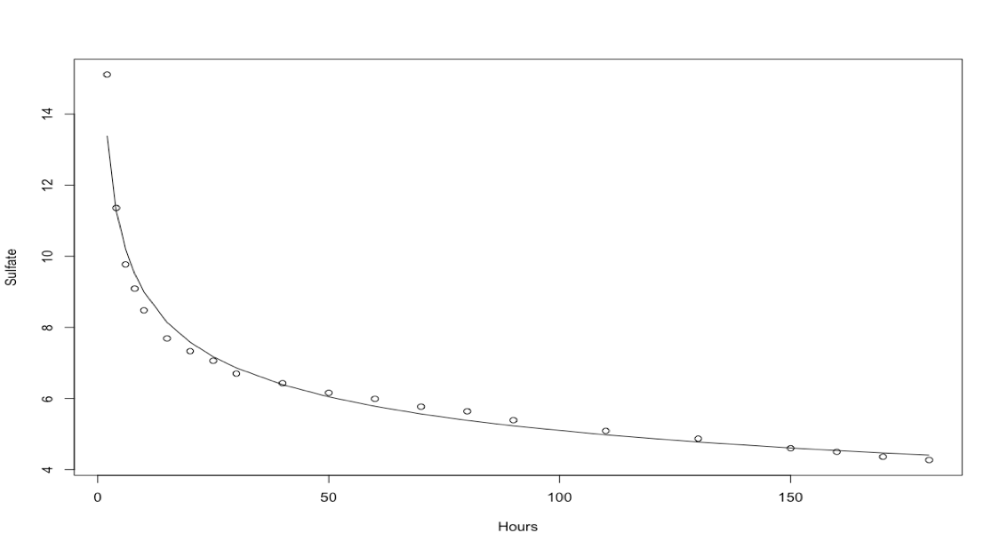
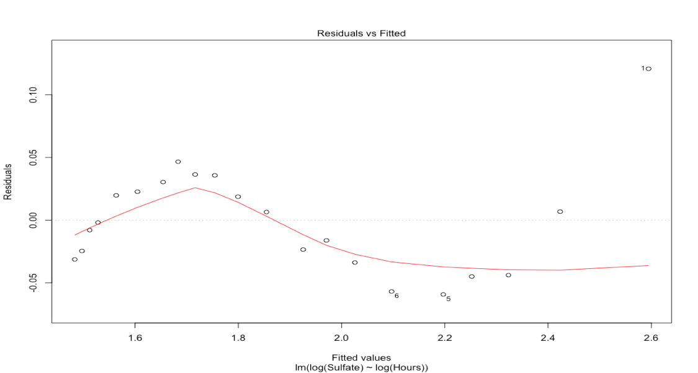
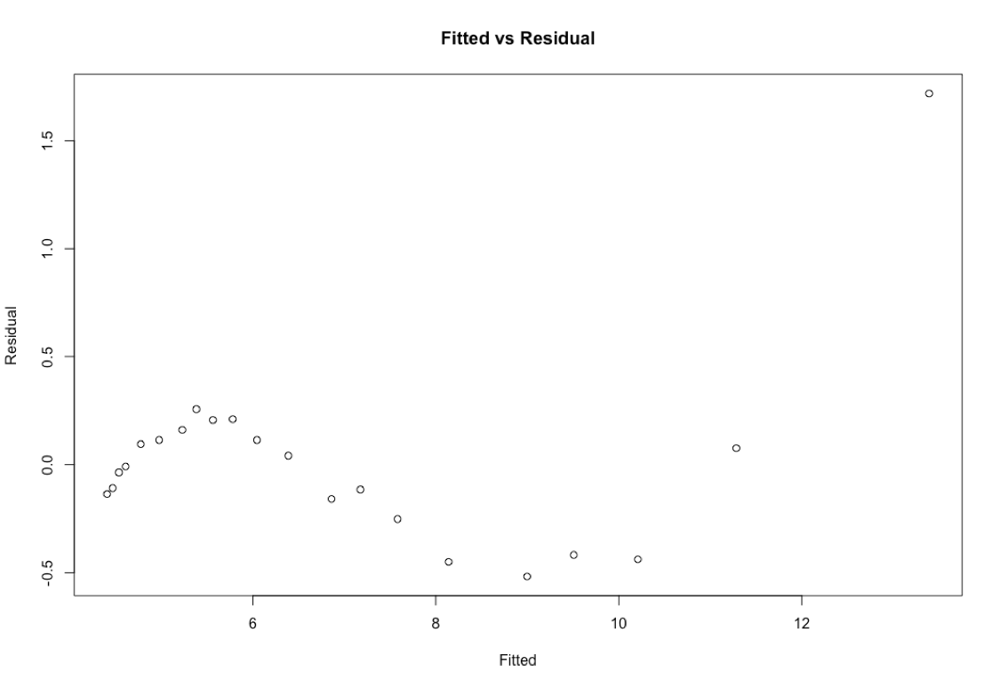
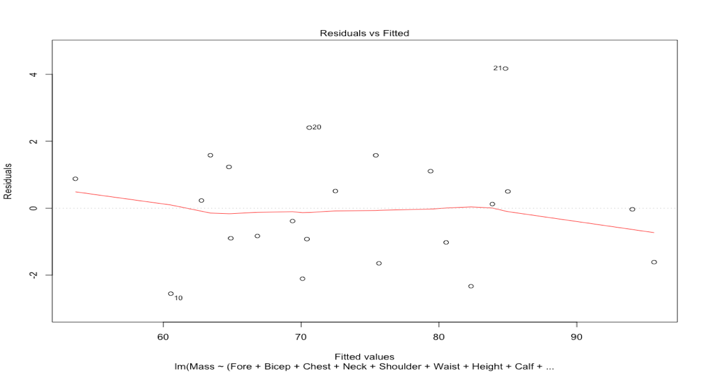
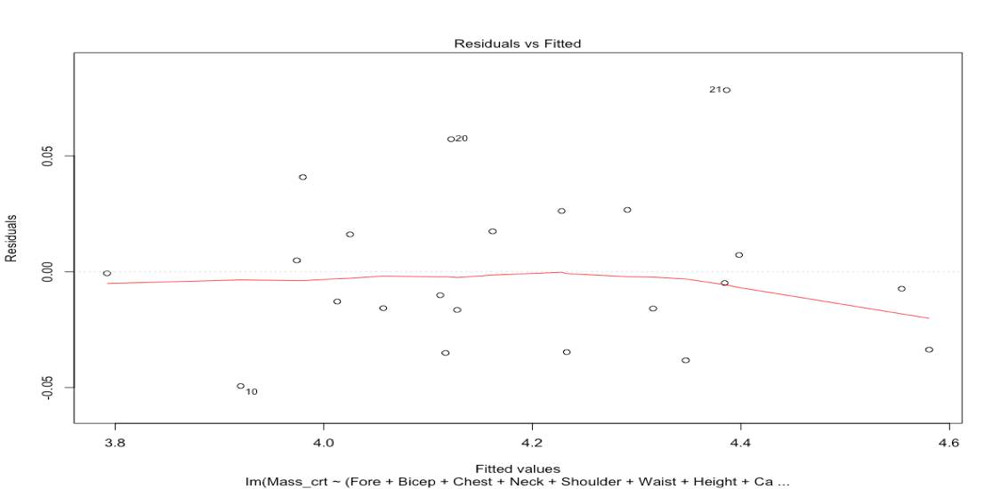
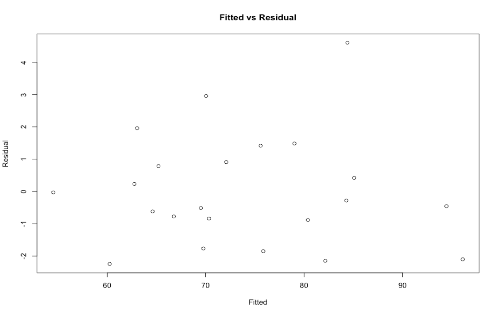
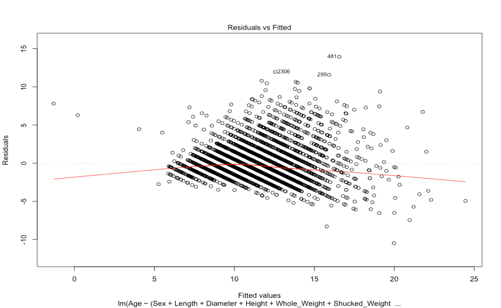
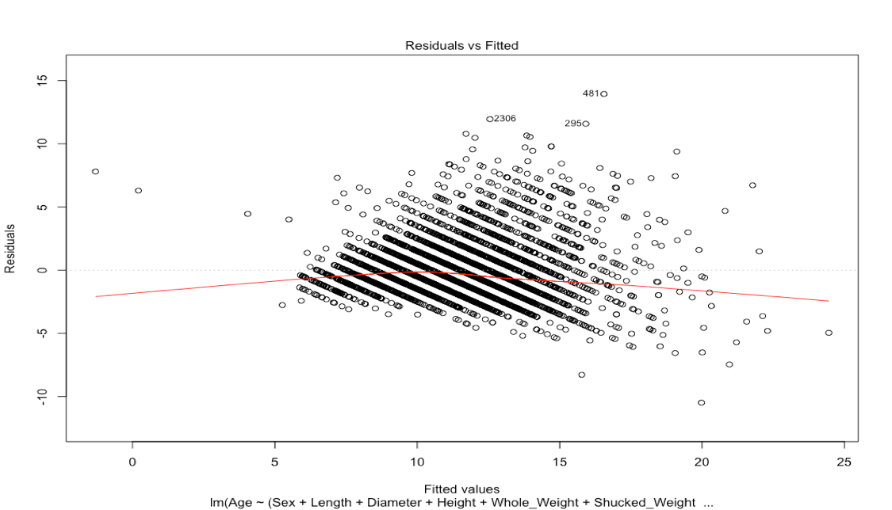
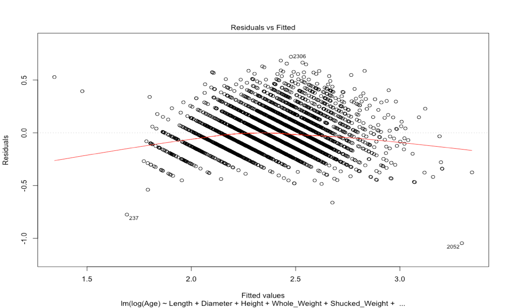
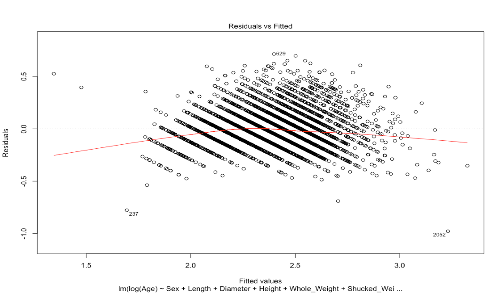

**Datasets**

I used three different datasets for this exploration. Below are their details

+ The Brunhilda dataset found at http://www.statsci.org/data/general/brunhild.html is a dataset that measures the  
  concentration of a sulfate in the blood of a baboon named Brunhilda as a function of time.
  
+ At http://www.statsci.org/data/oz/physical.html, I found a dataset of measurements by M. Larner, made in 1996. These  
  measurements include body mass, and various diameters.
  
+ The Abalone dataset foundt at https://archive.ics.uci.edu/ml/datasets/Abalone is a dataset of measurements by W. J. Nash, 
  T.L. Sellers, S. R. Talbot, A. J. Cawthorn and W. B. Ford, made in 1992. These are a variety of measurements of blacklip 
  abalone (Haliotis rubra; delicious by repute) of various ages and genders.
  
**Linear Regression**

In statistics, linear regression is a linear approach to modelling the relationship between a scalar response (or dependent variable) and one or more explanatory variables (or independent variables). The case of one explanatory variable is called simple linear regression. For more than one explanatory variable, the process is called multiple linear regression. This term is distinct from multivariate linear regression, where multiple correlated dependent variables are predicted, rather than a single scalar variable.

In linear regression, the relationships are modeled using linear predictor functions whose unknown model parameters are estimated from the data. Such models are called linear models. Most commonly, the conditional mean of the response given the values of the explanatory variables (or predictors) is assumed to be an affine function of those values; less commonly, the conditional median or some other quantile is used. Like all forms of regression analysis, linear regression focuses on the conditional probability distribution of the response given the values of the predictors, rather than on the joint probability distribution of all of these variables, which is the domain of multivariate analysis.

**Brunhilda Dataset**

First, I built a linear regression of the log of the concentration against the log of time using the R function 'lm'. Below is the plot showing the data points and the regression line in log-log coordinates.

Then, I prepared a plot showing the data points and the regression line in original coordinates.

Then, I plotted the residual against the fitted values in log-log and in original coordinates as seen below.

**Log-Log plot of Residual vs Fitted values**

**Original coordinates plot of Residual vs Fitted values**

The residual vs fitted plots above indicate that the residuals depart from 0 systematically. The residual values increase and are larger for smaller values of x and smaller for larger values of x, they again increase for larger values of x indicating clearly that a non-linear model would better describe the relationship between the two variables. The prediction would be better if we formulated a non-linear model rather than a linear one. So, based on this observation, I believe the regression model in original coordinates with the regression curve fit to the data points would perform better of the two in predicting the concentration.

**Body Mass Dataset**

I tried to build a linear regression of predicting the body mass from various diameters and plotted the residual against the fitted values. Below is the plot

**Residual vs Fitted values (Mass vs other measurements)**

Then, I regressed the cube root of mass against these diameters and plotted the residual against the fitted values in both these cube root coordinates and in the original coordinates as seen below.

**Residual vs Fitted values (Cubic Root of Mass vs other measurements)**

**Residual vs Fitted values (Plotted using Original Coordinates)**

The residual vs fitted plots look pretty much the same across different regression models. The plots using the original coordinates for mass vs residual values, cubic root of mass coordinates vs residual values and cubic root of mass transformed to original coordinates vs the residual values are almost identical, they do not exhibit any specific pattern including any fanning or funneling effect and there is basic random pattern to the residuals in all the cases and the variances on the error term appear to be equal. Also, the data points in the residual plots are displaced from the residual=0 line identically as they are from the regression line for all the models. I am inclined towards choosing the first regression model with original coordinates (first type of regression) which has a better R-Square value than the other.

**Abalone Dataset**

I built a linear regression predicting the age from the measurements, ignoring gender and plot the residual against the fitted values as seen below.

Then, I built a linear regression predicting the age from the measurements, including gender. There are three levels for gender; I represented gender numerically by choosing 1 for one level, 0 for another, and -1 for the third and plotted the residual against the fitted values.

And then, I built a linear regression predicting the log of age from the measurements, ignoring gender and plotted the residual against the fitted values.

Following the above regression model, I built a linear regression predicting the log of age from the measurements,
including gender, represented as above and plotted the residual against the fitted values.

The first two plots seem to be exhibiting a lot of funneling effect with the larger end of the funnel towards the larger fitted values and these may not be the ideal regression models, they do not exhibit a basic random pattern. Also, their r-squared values are lower than the next two regression models which makes me incline towards the regression models using log of Age vs other measurements. The residual vs fitted plots for the regression models using log of Age vs measurements including & excluding gender look similar, the funneling effect is not as bad as it was in the first two models. There seems to be some randomness in the plots and taking into consideration the r-squared values, I am inclined towards choosing the regression model using log of Age vs other measurements including gender out of the four regression models to predict the Age of Abalone.

