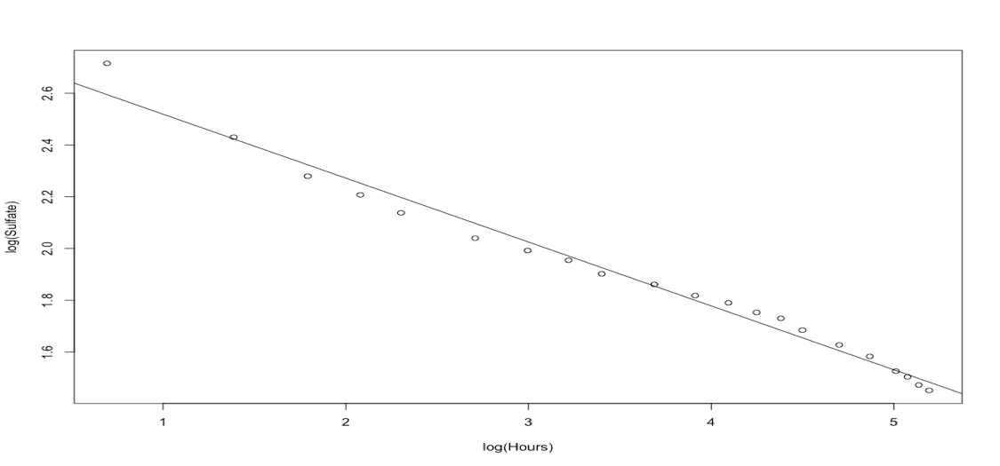

**Datasets**

I used three different datasets for this exploration. Below are their details

+ The Brunhilda dataset found at http://www.statsci.org/data/general/brunhild.html is a dataset that measures the  
  concentration of a sulfate in the blood of a baboon named Brunhilda as a function of time.
  
+ At http://www.statsci.org/data/oz/physical.html, I found a dataset of measurements by M. Larner, made in 1996. These  
  measurements include body mass, and various diameters.
  
+ The Abalone dataset foundt at https://archive.ics.uci.edu/ml/datasets/Abalone is a dataset of measurements by W. J. Nash, 
  T.L. Sellers, S. R. Talbot, A. J. Cawthorn and W. B. Ford, made in 1992. These are a variety of measurements of blacklip 
  abalone (Haliotis rubra; delicious by repute) of various ages and genders.

**Linear Regression**

In statistics, linear regression is a linear approach to modelling the relationship between a scalar response (or dependent variable) and one or more explanatory variables (or independent variables). The case of one explanatory variable is called simple linear regression. For more than one explanatory variable, the process is called multiple linear regression. This term is distinct from multivariate linear regression, where multiple correlated dependent variables are predicted, rather than a single scalar variable.

In linear regression, the relationships are modeled using linear predictor functions whose unknown model parameters are estimated from the data. Such models are called linear models. Most commonly, the conditional mean of the response given the values of the explanatory variables (or predictors) is assumed to be an affine function of those values; less commonly, the conditional median or some other quantile is used. Like all forms of regression analysis, linear regression focuses on the conditional probability distribution of the response given the values of the predictors, rather than on the joint probability distribution of all of these variables, which is the domain of multivariate analysis.

First, I built a linear regression of the log of the concentration against the log of time using the R function 'lm'. Below is the plot showing the data points and the regression line in log-log coordinates.

