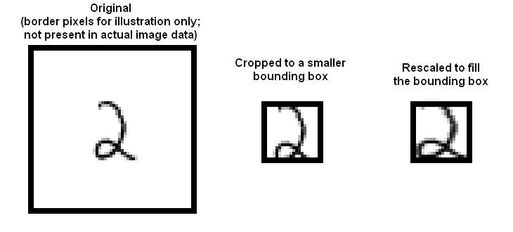

**Dataset**

The MNIST dataset is a dataset of 60,000 training and 10,000 test examples of handwritten digits, originally constructed by Yann Lecun, Corinna Cortes, and Christopher J.C. Burges. It is very widely used to check several methods. There are 10 classes in total ("0" to "9"). This dataset has been extensively studied, and there is a history of methods and feature construc- tions at https://en.wikipedia.org/wiki/MNIST_database and at the original site, http://yann.lecun.com/exdb/mnist/ . Please note that the best methods perform extremely well.

There is also a version of the data that was used for a Kaggle competition. This can be used as well for convenience so there would not be a need decompress Lecun's original format. It can be found at http://www.kaggle.com/c/digit-recognizer .

I used the original MNIST data files from http://yann.lecun.com/exdb/mnist/ , the dataset is stored in an unusual format, described in detail on the page. If the original dataset is being used then please begin by reading over the technical details. I built my own reader using the standard packages to read the binary files. Please note that in the readBin call the flag signed should bet set to FALSE since the data values are stored as unsigned integers. For additional reference, there is reader code in MATLAB available at http://ufldl.stanford.edu/wiki/index.php/Using_the_MNIST_Dataset .

Regardless of the format of the dataset, it consists of 28 x 28 images. These were originally binary images, but appear to be grey level images as a result of some anti-aliasing. I ignored mid grey pixels (there aren't many of them) and called dark pixels "ink pixels", and light pixels "paper pixels"; we can modify the data values with a threshold to specify the distinction, as described here https://en.wikipedia.org/wiki/Thresholding_(image_processing) . The digit has been centered in the image by centering the center of gravity of the image pixels, but as mentioned on the original site, this is probably not ideal. Here are some options I explored for re-centering the digits that I will refer to in the individual sections.

  + Untouched: Do not re-center the digits, but use the images as is.
  + Bounding box: Construct a 20 x 20 bounding box so that the horizontal (resp. vertical) range of ink pixels is centered in
    the box.
  + Stretched bounding box: Construct a 20 x 20 bounding box so that the horizontal (resp. vertical) range of ink pixels runs
    the full horizontal (resp. vertical) range of the box. Obtaining this representation will involve rescaling image pixels:
    we can find the horizontal and vertical ink range, cut that out of the original image, then resize the result to 20 x 20.
    Once the image has been re-centered, we can compute features.

Here are some pictures, which may help

**Naive Bayes Classification - Bernoulli vs. Gaussian**

Attempted classifying MNIST using naive Bayes. Table below shows the accuracy values for the four combinations of Gaussian v. Bernoulli distributions and untouched images v. stretched bounding boxes. I used 20 x 20 for the bounding box dimensions.

Based on the table below, Gaussian distribution seem to have performed better for Stretched images and Bernoulli distribution for untouched image pixels. 

| Accuracy | Gaussian | Bernoulli |
| --- | --- | --- |
| Untouched images (20x20) | 0.4849 | 0.831 |
| Untouched images as is (28x28) | 0.5352 | 0.8413 |
| Stretched bounding box | 0.8285 | 0.78 |

**MNIST Classification using Decision Forest**

Investigate classifying MNIST using a decision forest. For this you should use a library. For your forest construction, try out and compare the combinations of parameters shown in the table (i.e. depth of tree, number of trees, etc.) by listing the accuracy for each of the following cases: untouched raw pixels; stretched bounding box. Please use 20 x 20 for your bounding box dimensions.

The number of trees and depth seem to have an impact on accuracy. As the number of trees and depth increase, the accuracy looks to be increasing.

Untouched raw pixels cropped to 20x20:

|   | Depth = 4 | Depth = 8 | Depth = 16 |
| --- | --- | --- | --- |
| #trees = 10 | 0.8296 | 0.9266 | 0.9521 |
| #trees = 20 | 0.8533 | 0.9293 | 0.9615 |
| #trees = 30 | 0.8603 | 0.9335 | 0.9614 |

Untouched raw pixels as is 28x28:

|   | Depth = 4 | Depth = 8 | Depth = 16 |
| --- | --- | --- | --- |
| #trees = 10 | 0.8511 | 0.9322 | 0.9569 |
| #trees = 20 | 0.8654 | 0.9371 | 0.9628 |
| #trees = 30 | 0.8695 | 0.9399 | 0.9659 |

Stretched bounding box:

|   | Depth = 4 | Depth = 8 | Depth = 16 |
| --- | --- | --- | --- |
| #trees = 10 | 0.8553 | 0.9426 | 0.9574 |
| #trees = 20 | 0.8582 | 0.9442 | 0.9667 |
| #trees = 30 | 0.8655 | 0.9469 | 0.9685 |

**Appendix**

**Confusion Matrix and Statistics - Naive Bayes Normal 20 x 20 bounding**

          Reference

      Pred    0    1    2    3    4    5    6    7    8    9
         0  924    0  183  118   77  132   70   24   23   22
         1    0 1078   31   41   13   31   25   17   81   17
         2    3    0  133    2    4    1    0    1    2    3
         3    0    0   53  217    3    6    2    7    4    4
         4    0    0    0    1   58    0    1    2    2    0
         5    1    0    2    2    2   21    5    0    2    0
         6    5    3  106   10   24    5  611    3    1    0
         7    0    0    0    1    2    1    0  119    0    2
         8   46   52  517  577  504  655  243  215  825   98
         9    1    2    7   41  295   40    1  640   34  863

Overall Statistics

                  Accuracy : 0.4849
                    95% CI : (0.4751, 0.4947)
       No Information Rate : 0.1135
    P-Value [Acc &gt; NIR] : &lt; 2.2e-16
                     Kappa : 0.4274
      Mcnemar Test P-Value : NA

**Confusion Matrix and Statistics - Naive Bayes Bernoulli 20 x 20 bounding**

          Reference
          
      Pred    0    1    2    3    4    5    6    7    8    9
         0  902    0   22    7    5   30   28    1   17   12
         1    0 1073    9   19    5   11   18   25   15   16
         2    3   10  835   41    4    7   13   21   10    6
         3   10   10   40  834    1  143    2    3   83    9
         4    0    0   12    4  762   19   12   13   13   62
         5   22    6    6   13    6  591   36    0   11    6
         6   12    5   39    5   25   17  837    0    5    1
         7    2    0   13   13    2   11    0  858    7   29
         8   29   30   54   47   34   39   12   24  777   27
         9    0    1    2   27  138   24    0   83   36  841

Overall Statistics

                  Accuracy : 0.831
                    95% CI : (0.8235, 0.8383)
       No Information Rate : 0.1135
    P-Value [Acc &gt; NIR] : &lt; 2.2e-16
                     Kappa : 0.8121
      Mcnemar Test P-Value : NA

**Confusion Matrix and Statistics - Naive Bayes Normal 20 x 20 bounding with autocrop**

          Reference

      Pred   0   1   2   3   4   5   6   7   8   9
         0 938   3  18   6   3  17  14   0  10   5
         1   1 922  18   9  24  12  12  51  44  15
         2   3  43 826  24   5   5   8  39  30   7
         3   3   1  10 867   0  71   2  11  12   9
         4   5  32   5   2 814   8  40  15  15  49
         5   6  16  15  28   8 702  17   6  29   7
         6  11  19  14   0  26  22 848   0   9   0
         7   0  58  56  20   2   4   0 829  12  17
         8   9  30  58  36  17  23  14  17 686  47
         9   4  11  12  18  83  28   3  60 127 853

Overall Statistics

                  Accuracy : 0.8285
                    95% CI : (0.821, 0.8358)
       No Information Rate : 0.1135
    P-Value [Acc &gt; NIR] : &lt; 2.2e-16
                     Kappa : 0.8094
      Mcnemar Test P-Value : NA

**Confusion Matrix and Statistics - Naive Bayes Bernoulli 20 x 20 bounding with autocrop**

          Reference

      Pred   0   1   2   3   4   5   6   7   8   9
         0 953   1  40  10   3  26  24   3  13   5
         1  11 791  54  28  79  59  52 148  69  29
         2   0  39 784  16   2   3   2  20   5   4
         3   4  12  14 876   0 119   2  16  17   8
         4   1  22   2   1 729   5   7  11   0  27
         5   0   7   1   6   1 526   4   1   6   2
         6   4  24  23   4  31  39 862   0   7   0
         7   0  10  19   4   0   1   0 685   5   6
         8   5 223  86  57  19  84   4  43 776 110
         9   2   6   9   8 118  30   1 101  76 818

Overall Statistics

                  Accuracy : 0.78
                    95% CI : (0.7717, 0.7881)
       No Information Rate : 0.1135
    P-Value [Acc &gt; NIR] : &lt; 2.2e-16
                     Kappa : 0.7554
      Mcnemar Test P-Value : NA

**Confusion Matrix and Statistics - Naive Bayes Normal 28 x 28 bounding**

          Reference

      Pred    0    1    2    3    4    5    6    7    8    9
         0  862    0   94   40   22   69   16    2   13    8
         1    0 1081   24   33    2   25   13   14   67    7
         2    1    1  212    4    2    1    2    0    4    1
         3    3    0   87  310    0   19    0    7    6    5
         4    3    0    2    1  131    2    1    8    2    0
         5    4    0    2    4    4   35    4    2    7    0
         6   31   10  284   59   66   39  890    5   13    2
         7    1    0    5    7    7    1    0  228    3    3
         8   44   36  298  437  188  592   27   49  642   22
         9   31    7   24  115  560  109    5  713  217  961

Overall Statistics

                  Accuracy : 0.5352
                    95% CI : (0.5254, 0.545)
       No Information Rate : 0.1135
    P-Value [Acc &gt; NIR] : &lt; 2.2e-16
                     Kappa : 0.4832
      Mcnemar Test P-Value : NA

**Confusion Matrix and Statistics - Naive Bayes Bernoulli 28 x 28 bounding**

          Reference
          
      Pred    0    1    2    3    4    5    6    7    8    9
         0  887    0   19    5    2   23   18    1   16    9
         1    0 1085    8   15    6   12   18   24   23   13
         2    4   10  852   34    4    7   15   14   13    5
         3    7    5   29  844    0  129    2    4   76    9
         4    2    0   17    0  795   30   13   15   17   74
         5   41    9    4   13    4  627   35    0   22    8
         6   16    6   32    9   21   16  851    0    7    0
         7    1    0   14   15    1    8    0  871    6   24
         8   22   19   55   49   23   21    6   27  758   24
         9    0    1    2   26  126   19    0   72   36  843

Overall Statistics

                  Accuracy : 0.8413
                    95% CI : (0.834, 0.8484)
       No Information Rate : 0.1135
    P-Value [Acc &gt; NIR] : &lt; 2.2e-16
                     Kappa : 0.8236
      Mcnemar Test P-Value : NA
