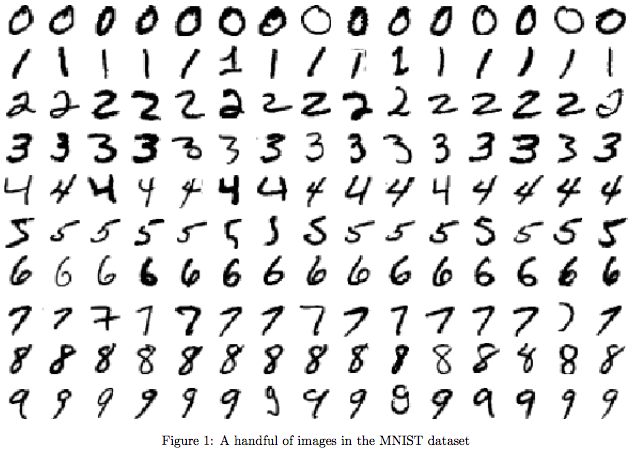
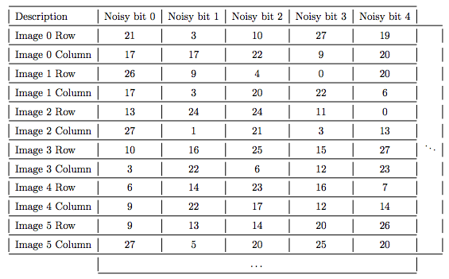
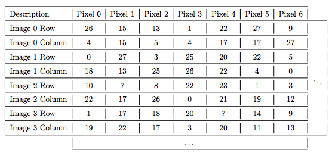
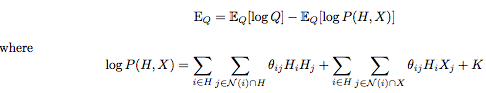
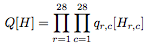
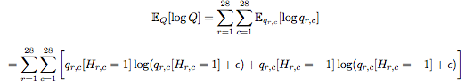
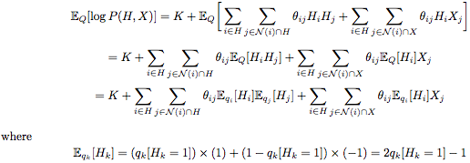
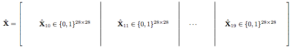
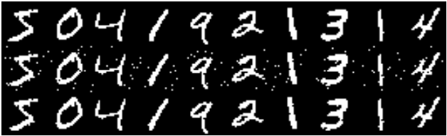

**Mean Field Inference**

Mean-Field Approximation is a useful method for inference, that originated in statistical physics. The Ising
model in its two-dimensional form is difficult to solve exactly, and therefore the mean-field approximation
methodology was utilized. This exploration will incorporate Mean field inference for denoising binary images. The MNIST dataset consists of 60,000 images of handwritten digits, curated by Yann LeCun, Corinna Cortes, and Chris Burges.
You can find the dataset at http://yann.lecun.com/exdb/mnist/ together with a collection of statistics on
recognition, etc.

**Setting up the Boltzmann Machine**

**1. Obtaining the dataset**

I obtained the MNIST training set, and binarized the first 20 images by mapping any value below .5 to -1 and any value above to 1. The original dataset at http://yann.lecun.com/exdb/mnist/ is in compressed format. I converted this data to a usable matrix format.

**2. Adding pre-determined noise to the dataset**

For each image, I obtained a noisy version by flipping some of the pixels. The exact location of the pixels that need to be flipped for each image can be found in the file NoiseCoordinates.csv. All values in this file are 0-based. In other words, the images are indexed as Image 0, 1, · · · , 19. Also, the top left pixel of an image is indexed as being in row 0 and column 0.

**Sample from the NoiseCoordinates file**

**3. Building a Boltzman Machine for denoising the images and using Mean-Field Inference**

I denoised each image using a Boltzmann machine model and mean field inference. For this:
• I used θij = 0.8 for the Hi, Hj terms and θij = 2 for the Hi, Xj terms.
• I followed a certain order which can be found in the file UpdateOrderCoordinates.csv to update each image is given in the
  supplementary file UpdateOrderCoordinates.csv
  

• The initial parameters that I used for the model can be found in the supplementary file named as InitalParametersModel.csv.   This file is the initial matrix Q stored as comma-separated values, with a dimension of 28 × 28. Each entry of the matrix     falls in the [0, 1] interval, and the Qr,c  entry denotes the qr,c[Hr,c = 1] initial probability. I used the same initial
  parameters for all the Boltzman machines built for each image.
• I ran the Mean-Field inference for exactly 10 iterations, where in each iteration the Q model distribution was updated with
  the same order shown and discussed in the table above.

**4. Turning in the energy function values computed initially and after each iteration**

First, I computed the variational free energy as given in the following.

A model independence assumption was made about the distribution.

Based on the independence assumption, the entropy term can be calculated as below

In order to avoid any computational complications in cases where I needed to compute 0 × log 0, I have added a very tiny value of Eps. = 10−10 insider the log. Based on the simplified log-likelihood term, I computed the entropy as below.

Since the K value is intractable to compute and has no effect on the optimization process of mean field approximation, I ignored it by setting K = 0. I then computed the EQ energy, and evaluated it both initially and after each iteration of updating the Q matrix. The final energy matrix can be found in energy_s1.csv where each row corresponds to the image, each column the iteration and the value represents the variational free energy of the Boltzman Machine used for the mth image  after the nth iteration of mean field inference.

**5. Displaying the reconstructed images**

I ran the mean-field approximation method for exactly 10 iterations (i.e. going over and updating the hidden distribution of each pixel for exactly 100 times) on the images indexed 0 through 19. After that, based on the approximated Q distribution, I computed the MAP image, and stored it in a binary {0, 1} matrix format. I have the prediction matrix with a shape of 28 rows, and 280 columns as defined in the following.

I have attached the denoised image matrix for images 10 through 19 in the project repository named as denoised_10_to_19.csv and 0 through 9 as denoised_0_to_9.csv. I have provided the sample denoised images for the first ten images below. 

