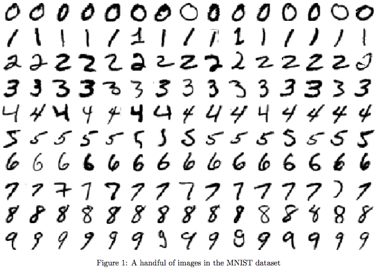
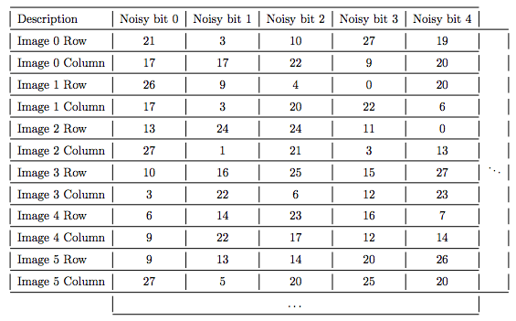

**Mean Field Inference**

Mean-Field Approximation is a useful method for inference, that originated in statistical physics. The Ising
model in its two-dimensional form is difficult to solve exactly, and therefore the mean-field approximation
methodology was utilized. This exploration will incorporate Mean field inference for denoising binary images. The MNIST dataset consists of 60,000 images of handwritten digits, curated by Yann LeCun, Corinna Cortes, and Chris Burges.
You can find the dataset at http://yann.lecun.com/exdb/mnist/ together with a collection of statistics on
recognition, etc.

**Setting up the Boltzmann Machine**

**1. Obtaining the dataset**

I obtained the MNIST training set, and binarized the first 20 images by mapping any value below .5 to -1 and any value above to 1. The original dataset at http://yann.lecun.com/exdb/mnist/ is in compressed format. I converted this data to a usable matrix format.

**2. Adding pre-determined noise to the dataset**

For each image, I obtained a noisy version by flipping some of the pixels. The exact location of the pixels that need to be flipped for each image can be found in the file NoiseCoordinates.csv. All values in this file are 0-based. In other words, the images are indexed as Image 0, 1, · · · , 19. Also, the top left pixel of an image is indexed as being in row 0 and column 0.

**Sample from the NoiseCoordinates file**

