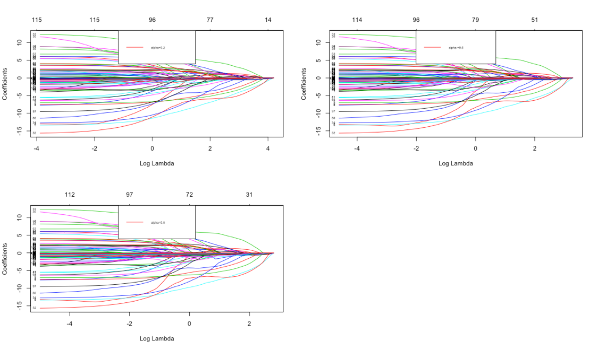
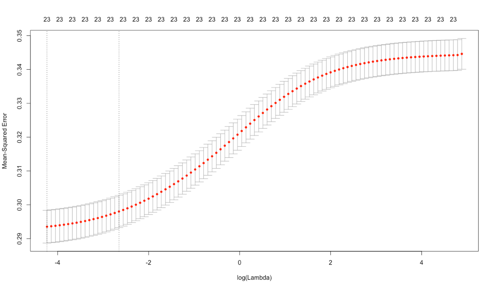
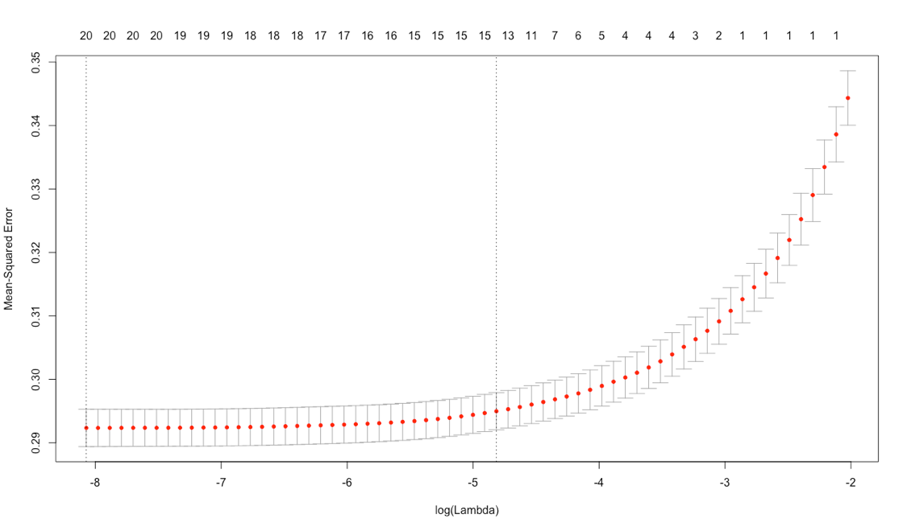
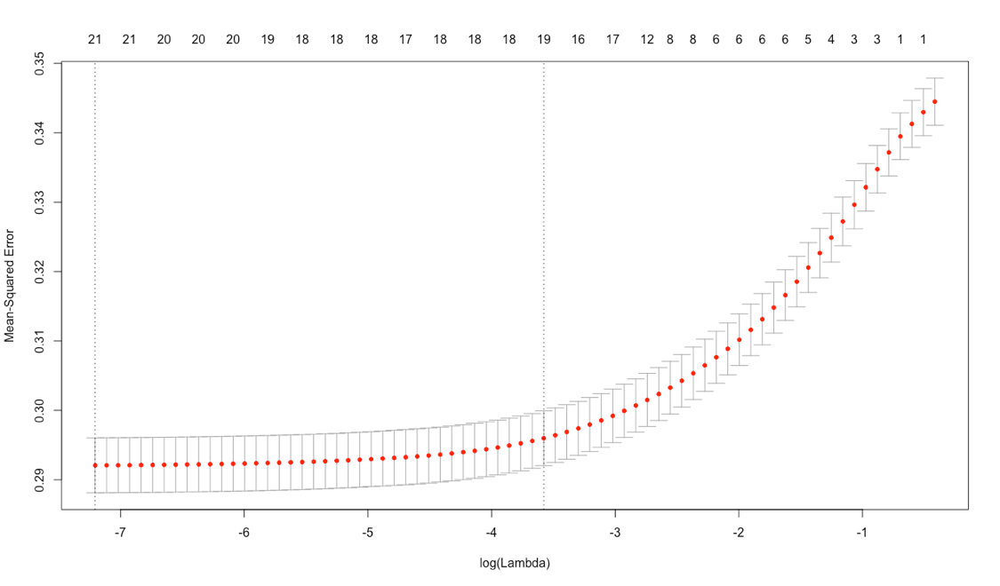
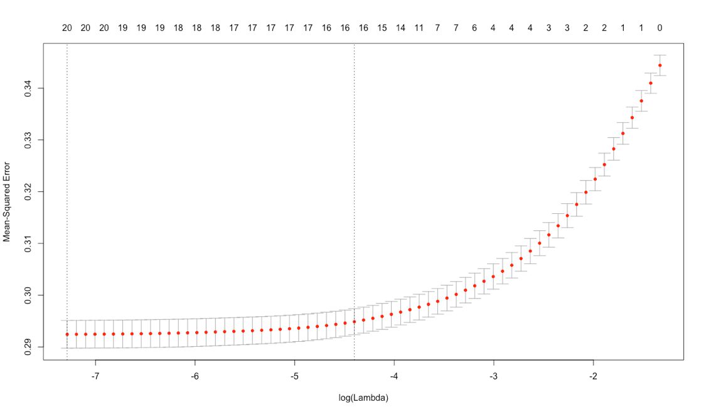
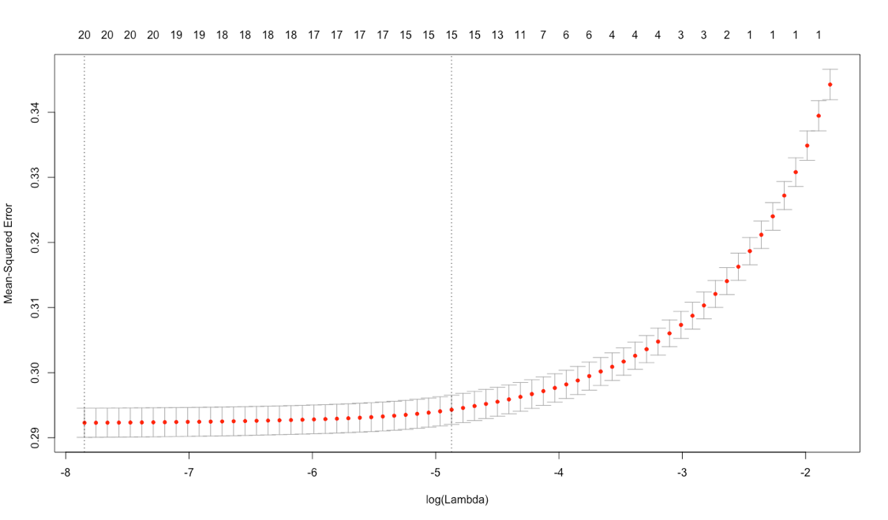

**Datasets**

I used the following datasets for this exploration.

For my exploration of Linear Regression using various regularizers, I used a dataset from the UCI Machine Learning Repository - https://archive.ics.uci.edu/ml/datasets/Geographical+Original+of+Music that gives features of music, and the latitude and longitude from which that music originates. There are actually two versions of this dataset. I used the one with more independent variables that I found more interesting. I ignored outliers did not try to deal with them. I also regarded latitude and longitude as entirely independent.

For Logistic Regression, I used a dataset that gives whether a Taiwanese credit card user defaults against a variety of features hosted in UCI Machine Learning Repository-http://archive.ics.uci.edu/ml/datasets/default+of+credit+card+clients.

**Linear Regression**

In statistics, linear regression is a linear approach to modelling the relationship between a scalar response (or dependent variable) and one or more explanatory variables (or independent variables). The case of one explanatory variable is called simple linear regression. For more than one explanatory variable, the process is called multiple linear regression. This term is distinct from multivariate linear regression, where multiple correlated dependent variables are predicted, rather than a single scalar variable.

In linear regression, the relationships are modeled using linear predictor functions whose unknown model parameters are estimated from the data. Such models are called linear models. Most commonly, the conditional mean of the response given the values of the explanatory variables (or predictors) is assumed to be an affine function of those values; less commonly, the conditional median or some other quantile is used. Like all forms of regression analysis, linear regression focuses on the conditional probability distribution of the response given the values of the predictors, rather than on the joint probability distribution of all of these variables, which is the domain of multivariate analysis.

**Regularization**

We will discuss the following three regularization methods briefly.

+ L1 Regularization
+ L2 Regularization
+ Elasticnet Regularization

A regression model that uses L1 regularization technique is called Lasso Regression and model which uses L2 is called Ridge Regression. The key difference between these two is the penalty term.

**Ridge regression** adds "squared magnitude" of coefficient as penalty term to the loss function. Here the highlighted part represents L2 regularization element. 

Here, if lambda is zero then you can imagine we get back OLS. However, if lambda is very large then it will add too much weight and it will lead to under-fitting. Having said that it’s important how lambda is chosen. This technique works very well to avoid over-fitting issue.

**Lasso Regression** (Least Absolute Shrinkage and Selection Operator) adds “absolute value of magnitude” of coefficient as penalty term to the loss function. 

Again, if lambda is zero then we will get back OLS whereas very large value will make coefficients zero hence it will under-fit.

The key difference between these two techniques is that Lasso shrinks the less important feature’s coefficient to zero thus, removing some feature altogether. So, this works well for feature selection in case we have a huge number of features.

Traditional methods like cross-validation, stepwise regression to handle overfitting and perform feature selection work well with a small set of features but these techniques are a great alternative when we are dealing with a large set of features.

**Elasticnet regression** is a regularized regression method that linearly combines the L1 and L2 penalties of the lasso and ridge methods.

**Implementation**

I built a straightforward linear regression of "latitude" against features. The R-squared value observed for linear regression with latitude as independent variable is 0.2928. Below are the plots for this regression.

Then, I built a straightforward linear regression of "longitude" against features. The R-squared value observed for linear regression with longitude as independent variable is 0.3646. Below are the plots for this regression.

**Box Cox Transformation**

I tried to improve the straightforward regression using latitude (resp. longtiude) against the features using Box Cox transformation. Below are the Box Cox Transformation plots.

**Box Cox transformation plots - Latitude as independent variable**

**Box Cox transformation plots - Longitude as independent variable**

The Box Cox transformation did not seem to improve the regression for both latitude and longitude transformations, the best lambda value achieved for latitude was 3.6 to maximize the log likelihood of the linear model which was outside -2 to +2 range and generally when the lambda value is outside this range, boxcox transformation may not be the ideal way to improve regression. Also, the R-squared value for linear regression on latitude against the features using the box cox transformed data is 0.32725 only when the lambda value is 3.6 but did not show any improvement when the lambda value was between -2 to +2.

Similarly, for longitude, the best lambda value achieved was 1.1 to maximize the log likelihood of the linear model and the value being close to 1 indicated that box cox transformation did not have any impact on improving the regression and also the R-squared value for linear regression on longitude against the features using the box cox transformed data was 0.3653 which was almost the same as R-squared value achieved through the straight forward regression.

Based on the above observations, Box cox transformation did not improve the regression significantly. So, I decided to use the raw data.

**Inverse Box Cox Transform**

I tried to inverse the box cox transform and fit the predictions of the linear model to original coordinates both for latitude and longitude regressions. The R-squared value observed for the Latitude regression after inversing box cox & fitting predictions of model to original coordinates was 0.2630615 and for Longitude regression was 0.3645875. There was no improvement and in fact the r-squared values were worse (significantly for latitude regression) and I was able to conclude that inversing box cox and fitting predictions of the models back to original coordinates did not improve the regression either.

**Linear Regression using Regularization**

**Latitude as independent variable**

Using glmnet I produced a regression regularized by L2 (equivalently, a ridge regression), L1 (equivalently, a lasso regression) and Elastic net (equivalently, a regression regularized by a convex combination of L1 and L2). I estimated the regularization coefficient that produces the minimum error for these regularization types. I tried three values of alpha for the elastic net regression (alpha=0.2, alpha=0.5 and alpha=0.8).

Following are the different plots obtained for these regression including the unregularized regression for latitude & longtitude.

**Unregularized - latitude regression**

**Unregularized - longitude regression**

**L2 Regularized - latitude regression**

**Coefficients vs Log Likelihood plot for latitude regression**

**L2 Regularized - longitude regression**

**Coefficients vs Log Likelihood plot for longitude regression**

**L1 Regularized - latitude regression**

**Coefficients vs Log Likelihood plot for latitude regression**

**L1 Regularized - longitude regression**

**Coefficients vs Log Likelihood plot for longitude regression**

**Elastic net Regularized - latitude regression**

**Coefficients vs Log Likelihood plot for elastic net regression**

**Elastic net Regularized - longitude regression**

**Coefficients vs Log Likelihood plot for longitude regression**

**Table - MSE and Optimal Regularization Coefficient**

**Inference from Regularization plots above**

Based on the analysis conducted above and the CV errors obtained if I go by plain numbers, elasticnet seemed to have  generated a low CV error compared to the other models but the difference in MSE between elasticnet and other models was not significant (less than 2%). The residual vs fitted plots for unregularized regression shows a lot of randomness and did not see any specific patterns which was good (there is slight funneling with latitude plot) and seems to have a better rsquared value compared to other models. For the purpose of the this exploration I will go by the cross validated prediction error and choose elasticnet as the better performing model although there was not a significant difference in the error value.

**Logistic Regression**

In regression analysis, logistic regression or logit regression is estimating the parameters of a logistic model. More formally, a logistic model is one where the log-odds of the probability of an event is a linear combination of independent or predictor variables. The two possible dependent variable values are often labelled as "0" and "1", which represent outcomes such as pass/fail, win/lose, alive/dead or healthy/sick. The binary logistic regression model can be generalized to more than two levels of the dependent variable: categorical outputs with more than two values are modelled by multinomial logistic regression, and if the multiple categories are ordered, by ordinal logistic regression, for example the proportional odds ordinal logistic model.

On the Taiwanese Credit Card User defaults dataset, I performed logistic regression to predict whether a user defaults. I  ignored outliers, but tried the various regularization schemes discussed above. Following are the plots obtained for the different regularization schemes and the table below shows the MSE and optimal regularization coefficient for each of the regularization schemes.

**Alpha=0 (Ridge)**

**Alpha=1 (Lasso)**

**Alpha=0.2 (Elastic net)**

**Alpha=0.5 (Elastic net)**

**Alpha=0.8 (Elastic net)**

**Inference of Logistic Regression models**

The unregularized regression seemed to have a low MSE compared to the regularized versions and I considered it the winner. I also did a stepwise a variable selection in the unregularized regression using the step function and estimated the coefficients based on the optimized model. The accuracy (or error rate) was almost the same across regularized and unregularized versions with the unregularized version slightly better (very small difference). 

