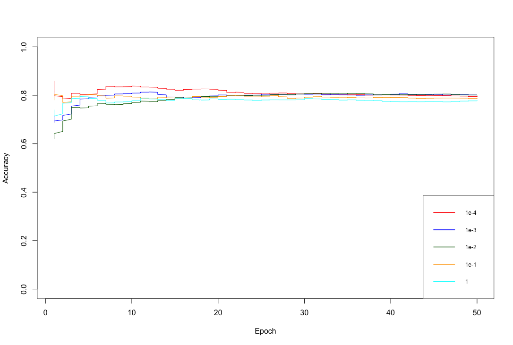
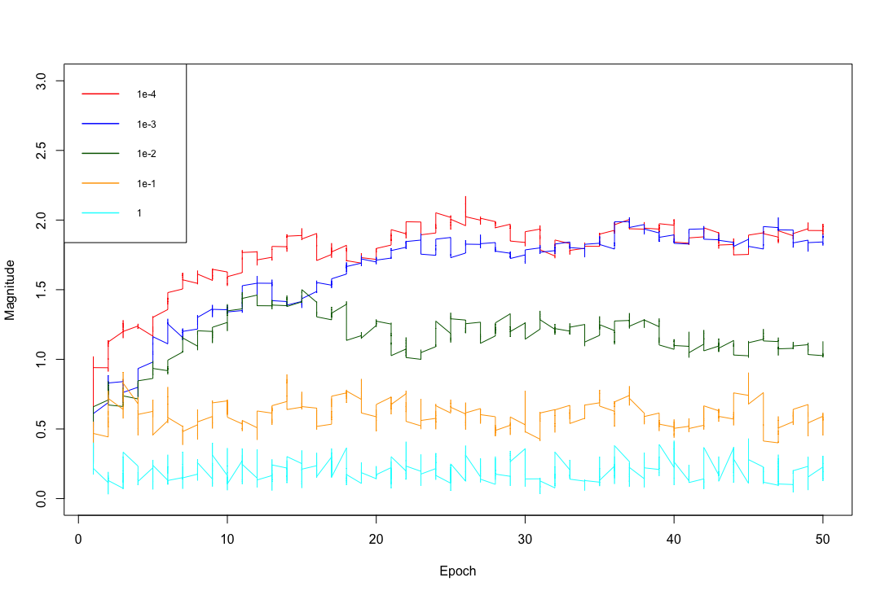

**Dataset**

The UC Irvine machine learning data repository hosts a collection of data on adult income, donated by Ronny Kohavi and Barry Becker. You can find this data at https://archive.ics.uci.edu/ml/datasets/Adult For each record, there is a set of continuous attributes, and a class "less than 50K" or "greater than 50K". There are 48842 examples. I used only the continuous attributes (see the description on the web page) and dropped examples where there are missing values of the continuous attributes. I also separated the resulting dataset randomly into 10% validation, 10% test, and 80% training examples.

**SVM Classification using Stochastic Gradient Descent**

I implemented and trained a support vector machine on the data using stochastic gradient descent. I did not use a package to train the classifier but wrote my own code. I ignored the id number, and used the continuous variables as a feature vector. I scale these variables so that each had unit variance. I also searched for an appropriate value of the regularization constant, and tried at least the values [1e-3, 1e-2, 1e-1, 1]. Used a validation set for this search. I used at least 50 epochs of at least 300 steps each. In each epoch, I separated out 50 training examples at random for evaluation (called this the set held out for the epoch). I computed the accuracy of the current classifier on the set held out for the epoch every 30 steps.

Based on the implementation above I produced the following

+ Plot of the accuracy every 30 steps, for each value of the regularization constant.
+ plot of the magnitude of the coefficient vector every 30 steps, for each value of the regularization constant.
+ Estimate of the best value of the regularization constant, together with a brief description of why you believe that is a good value.
+ Estimate of the accuracy of the best classifier on the 10% test dataset data

**Plot of accuracy every 30 steps for each value of regularization constant:**

Chosen regularization constants: 1, 1e-1, 1e-2, 1e-3, 1e-4

**Plot of the magnitude of coefficient vector every 30 steps for each value of regularization constant:**

Chosen regularization constants: 1, 1e-1, 1e-2, 1e-3, 1e-4

**Best value for regularization constant:**

I did 10 different runs on the 10% validation set, the average accuracy on the validation set for regularization constant values of : 1, 1e-1, 1e-2, 1e-3, 1e-4 were 0.7648372, 0.77584477, 0.78666121, 0.79256092 & 0.79607617. Based on the average values above, my estimate on the best value of regularization constant is 1e-4. 

A low value on the regularization parameter was increasing the width of the margin of the hyperplane. SVM tries to find a hyperplane with the largest minimum margin and one that correctly separates the classes as much as possible. It is also understood that both together are not achievable and as evident from my multiple tests, the number of misclassified examples keeps increasing as the regularization value gets smaller and the accuracy decreases. Therefore, I had to choose an optimal regularization value that is neither too large nor too small and can offer reasonable accuracy combined with largest minimum margin, that value seems to be 1e-4 (based on the regularization values I chose) in several cases for the chosen dataset. The prediction accuracy on the test set is high for the regularization values of 1e-3 in some cases and 1e-4 for several cases.  

**Best accuracy on 10% test set:**

The best accuracy value obtained on 10% of the test set is 0.8202293
